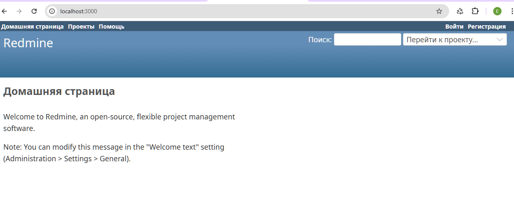
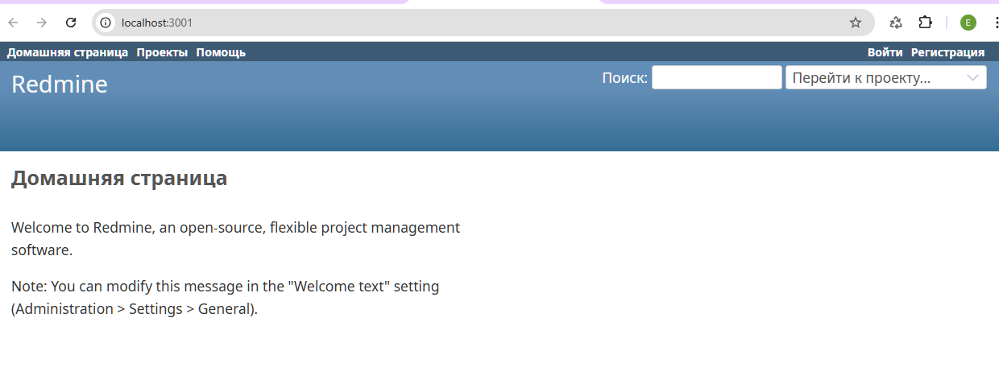

# Домашнее задание: Docker - Redmine с MySQL и PostgreSQL

## Цель работы
- Познакомиться с контейнеризацией
- Научиться создавать Docker-образы и запускать контейнеры
- Запустить два экземпляра Redmine с разными СУБД на одном хосте

## Описание задания
Запустить на одном хосте два приложения Redmine:
- a) Redmine с использованием MySQL
- б) Redmine с использованием PostgreSQL

Приложения должны работать одновременно, не мешая друг другу.


## Вывод команд из терминала

### Создание сети и запуск MySQL Redmine
```bash
elv@ub24:~$ docker network create redmine-mysql-net

elv@ub24:~$ docker run -d \
  --name redmine-mysql-db \
  --network redmine-mysql-net \
  -e MYSQL_ROOT_PASSWORD=rootpass \
  -e MYSQL_DATABASE=redmine \
  -e MYSQL_USER=redmine \
  -e MYSQL_PASSWORD=redminepass \
  -v redmine-mysql-data:/var/lib/mysql \
  mysql:8.0

elv@ub24:~$ docker run -d \
  --name redmine-mysql-app \
  --network redmine-mysql-net \
  -p 3000:3000 \
  -e REDMINE_DB_MYSQL=redmine-mysql-db \
  -e REDMINE_DB_MYSQL_PORT=3306 \
  -e REDMINE_DB_USERNAME=redmine \
  -e REDMINE_DB_PASSWORD=redminepass \
  -e REDMINE_DB_DATABASE=redmine \
  -v redmine-mysql-files:/usr/src/redmine/files \
  redmine:latest

```

### Запуск PostgreSQL Redmine
```bash
elv@ub24:~$ docker network create redmine-postgres-net

elv@ub24:~$ docker run -d \
  --name redmine-postgres-db \
  --network redmine-postgres-net \
  -e POSTGRES_PASSWORD=postgrespass \
  -e POSTGRES_DB=redmine \
  -v redmine-postgres-data:/var/lib/postgresql/data \
  postgres:15

elv@ub24:~$ docker run -d \
  --name redmine-postgres-app \
  --network redmine-postgres-net \
  -p 3001:3000 \
  -e REDMINE_DB_POSTGRES=redmine-postgres-db \
  -e REDMINE_DB_PORT=5432 \
  -e REDMINE_DB_USERNAME=postgres \
  -e REDMINE_DB_PASSWORD=postgrespass \
  -e REDMINE_DB_DATABASE=redmine \
  -v redmine-postgres-files:/usr/src/redmine/files \
  redmine:latest
```
## Результат работы

### Скриншоты
*Рисунок 1 - Redmine с MySQL на порту 3000*


*Рисунок 2 - Redmine с PostgreSQL на порту 3001*


### Статус запущенных контейнеров
```bash
elv@ub24:~$ docker ps
CONTAINER ID   IMAGE            COMMAND                  CREATED          STATUS          PORTS                                         NAMES
581941b5dcbb   redmine:latest   "/docker-entrypoint.…"   4 minutes ago    Up 4 minutes    0.0.0.0:3001->3000/tcp, [::]:3001->3000/tcp   redmine-postgres-app
f118933b8fcf   postgres:15      "docker-entrypoint.s…"   5 minutes ago    Up 5 minutes    5432/tcp                                      redmine-postgres-db
db4a104c62bc   redmine:latest   "/docker-entrypoint.…"   15 minutes ago   Up 15 minutes   0.0.0.0:3000->3000/tcp, [::]:3000->3000/tcp   redmine-mysql-app
cc04bdd46996   mysql:8.0        "docker-entrypoint.s…"   26 minutes ago   Up 26 minutes   3306/tcp, 33060/tcp                           redmine-mysql-db
```