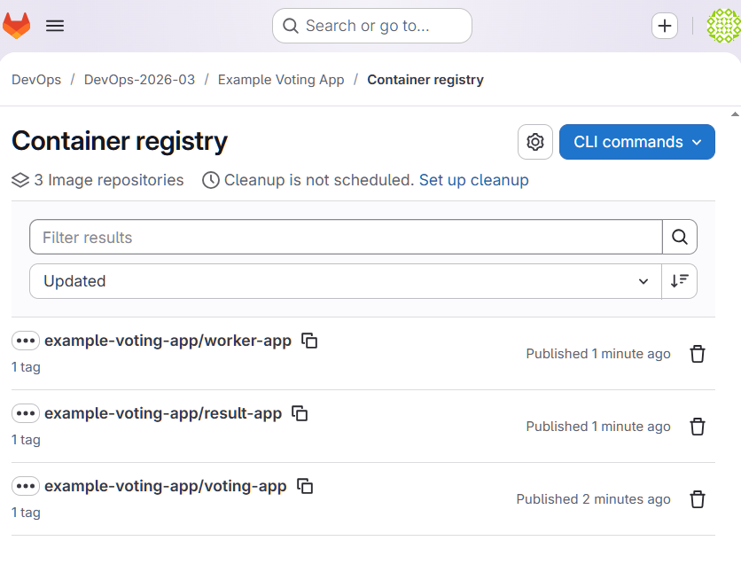
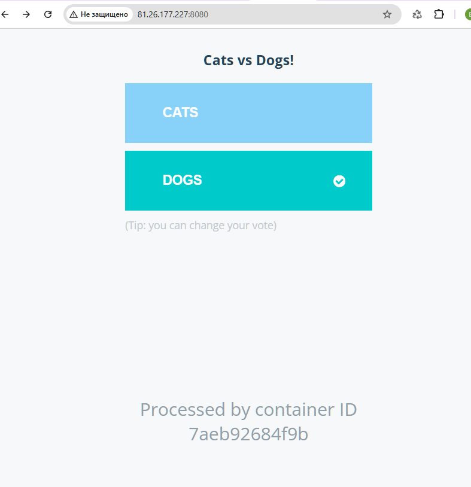
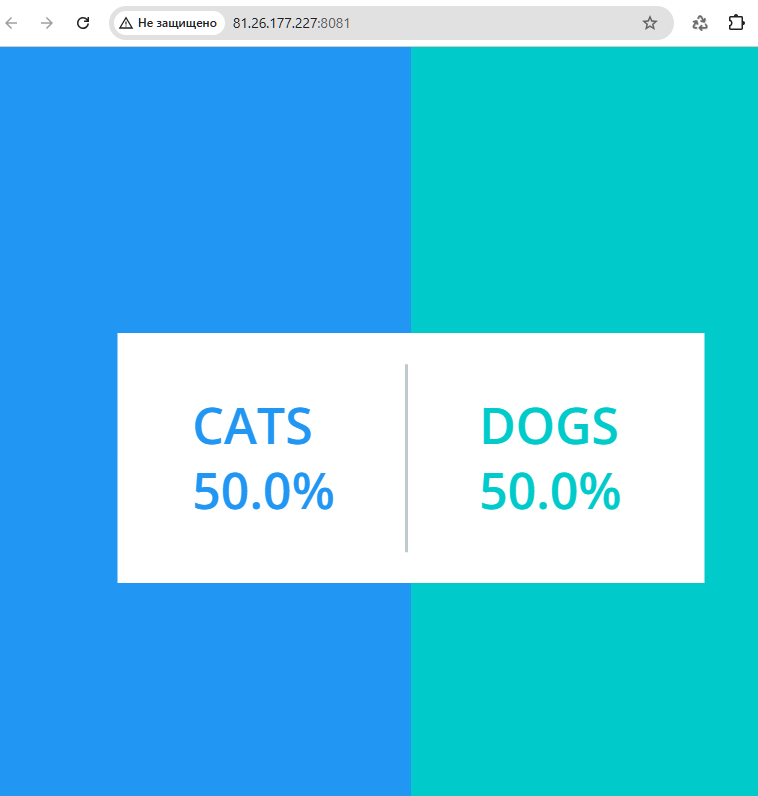

# Домашнее задание: Docker && Volumes

## Цель
Собрать и опубликовать Docker-образы микросервисного приложения с настройкой volumes и сети; развернуть их в Yandex Cloud для эксплуатации сервиса.

## Используемое приложение
[example-voting-app](https://github.com/dockersamples/example-voting-app) - распределенное приложение для голосования, состоящее из 5 микросервисов:
- **vote** (Python) - веб-интерфейс для голосования
- **result** (Node.js) - веб-интерфейс для просмотра результатов
- **worker** (.NET) - обработчик голосов
- **redis** - брокер сообщений для сбора голосов
- **postgres** - база данных для хранения результатов

---

## 1. Сборка Docker-образов

```bash
# Сборка каждого образа отдельно
docker build -t voting-app ./vote
docker build -t result-app ./result
docker build -t worker-app ./worker

# Проверка собранных образов
docker images | grep -E "voting|result|worker"
```

**Результат:**
```
IMAGE               ID             DISK USAGE
result-app:latest   e507b2d18135        321MB
voting-app:latest   fae3a1ae90b6        239MB
worker-app:latest   5527020985f1        288MB
```

---

## 2. Создание Docker volumes для хранения данных

```bash
# Создание volumes
docker volume create postgres-data
docker volume create redis-data

# Проверка
docker volume ls
```

**Результат:**
```
DRIVER    VOLUME NAME
local     postgres-data
local     redis-data
```

---

## 3. Создание отдельной Docker сети

```bash
# Создание сети для микросервисного приложения
docker network create voting-network

# Проверка
docker network ls
```

**Результат:**
```
NETWORK ID     NAME             DRIVER
8bbbd35da93d   voting-network   bridge
```

---

## 4. Запуск контейнеров

### 4.1 Запуск PostgreSQL (БД)

```bash
docker run -d \
  --name postgres-db \
  --network voting-network \
  -e POSTGRES_USER=postgres \
  -e POSTGRES_PASSWORD=postgres \
  -e POSTGRES_DB=postgres \
  -v postgres-data:/var/lib/postgresql/data \
  --restart always \
  postgres:15-alpine
```

### 4.2 Запуск Redis

```bash
docker run -d \
  --name redis \
  --network voting-network \
  -v redis-data:/data \
  --restart always \
  redis:alpine
```

### 4.3 Запуск Voting App (Python)

```bash
docker run -d \
  --name voting-app \
  --network voting-network \
  -p 8080:80 \
  --restart always \
  voting-app
```

### 4.4 Запуск Worker (.NET)

```bash
docker run -d \
  --name worker \
  --network voting-network \
  --restart always \
  worker-app
```

### 4.5 Запуск Result App (Node.js)

```bash
docker run -d \
  --name result-app \
  --network voting-network \
  -p 8081:80 \
  --restart always \
  result-app
```

---

## 5. Проверка работы всех контейнеров

```bash
# Статус всех контейнеров
docker ps -a
```

**Результат:**
```
CONTAINER ID   IMAGE                STATUS              PORTS                                     NAMES
8118f952c42b   result-app           Up                  0.0.0.0:8081->80/tcp                      result-app
c8ba296e398a   worker-app           Up                                                           worker
1df482f0e8d8   voting-app           Up                  0.0.0.0:8080->80/tcp                      voting-app
9571c00c70a5   redis:alpine         Up                  6379/tcp                                  redis
1fe5b66dbb07   postgres:15-alpine   Up                  5432/tcp                                  postgres-db
```

### Проверка логов сервисов

```bash
# Логи voting-app
docker logs voting-app

# Логи result-app (может ожидать подключения к БД)
docker logs result-app

# Логи worker
docker logs worker

# Логи redis
docker logs redis

# Логи postgres-db
docker logs postgres-db
```

### Проверка Docker сети

```bash
docker network inspect voting-network
```

**Результат:** все 5 контейнеров подключены к сети с IP-адресами в диапазоне 172.18.0.0/16.

---

## 6. Скрипт бэкапирования volumes

### `backup_volumes.sh`

```bash
#!/bin/bash

BACKUP_DIR="/backups"
DATE=$(date +%Y%m%d_%H%M%S)
VOLUMES=("postgres-data" "redis-data")

mkdir -p $BACKUP_DIR

for VOLUME in "${VOLUMES[@]}"; do
    echo "Backing up volume: $VOLUME"
    
    docker run --rm \
        -v ${VOLUME}:/source:ro \
        -v ${BACKUP_DIR}:/backup \
        alpine tar czf /backup/${VOLUME}_${DATE}.tar.gz -C /source .
    
    if [ $? -eq 0 ]; then
        echo "✓ Successfully backed up $VOLUME"
        ls -lh $BACKUP_DIR/${VOLUME}_${DATE}.tar.gz
    else
        echo "✗ Failed to backup $VOLUME"
    fi
done

# Удаление бэкапов старше 7 дней
find $BACKUP_DIR -name "*.tar.gz" -mtime +7 -delete

echo "Backup completed at $(date)"
```

**Запуск скрипта:**
```bash
chmod +x backup_volumes.sh
sudo mkdir -p /backups
sudo chown $USER:$USER /backups
./backup_volumes.sh
```

**Результат:**
```
Backing up volume: postgres-data
✓ Successfully backed up postgres-data
-rw-r--r-- 1 root root 4.5M May  5 18:50 /backups/postgres-data_20260505_184956.tar.gz

Backing up volume: redis-data
✓ Successfully backed up redis-data
-rw-r--r-- 1 root root 94 May  5 18:50 /backups/redis-data_20260505_184956.tar.gz

Backup completed at Tue May  5 06:50:04 PM UTC 2026
```

**Пути бэкапирования:**
- **Что бэкапится:** Docker volumes `postgres-data` и `redis-data`
- **Куда бэкапится:** `/backups/` на хост-машине
- **Формат имени:** `{volume_name}_{YYYYMMDD_HHMMSS}.tar.gz`
- **Ротация:** автоматическое удаление бэкапов старше 7 дней

---

## 7. Публикация образов в GitLab Docker Registry

### Логин в GitLab Registry

```bash
# Добавить в .bashrc для автоматической аутентификации
echo "glpat-***************" | docker login otusteam.gitlab.yandexcloud.net:5050 -u elm.g2016@yandex.ru --password-stdin
```

### Тегирование образов

```bash
# Тегирование voting-app
docker tag voting-app:latest otusteam.gitlab.yandexcloud.net:5050/devops/devops-2026-03/example-voting-app/voting-app:latest

# Тегирование result-app
docker tag result-app:latest otusteam.gitlab.yandexcloud.net:5050/devops/devops-2026-03/example-voting-app/result-app:latest

# Тегирование worker-app
docker tag worker-app:latest otusteam.gitlab.yandexcloud.net:5050/devops/devops-2026-03/example-voting-app/worker-app:latest
```

### Push образов

```bash
docker push otusteam.gitlab.yandexcloud.net:5050/devops/devops-2026-03/example-voting-app/voting-app:latest
docker push otusteam.gitlab.yandexcloud.net:5050/devops/devops-2026-03/example-voting-app/result-app:latest
docker push otusteam.gitlab.yandexcloud.net:5050/devops/devops-2026-03/example-voting-app/worker-app:latest
```

***Скриншот: образы в GitLab Registry***



---

## 8. Развертывание в Yandex Cloud

### Подключение к ВМ и настройка

```bash
# Подключение к виртуальной машине
ssh -i ~/.ssh/id_ed25519_otus_yc yc-user@<VM_IP>
```

### Логин в GitLab Registry на ВМ

```bash
docker login otusteam.gitlab.yandexcloud.net:5050
```

### Pull образов из GitLab Registry

```bash
docker pull otusteam.gitlab.yandexcloud.net:5050/devops/devops-2026-03/example-voting-app/voting-app:latest
docker pull otusteam.gitlab.yandexcloud.net:5050/devops/devops-2026-03/example-voting-app/result-app:latest
docker pull otusteam.gitlab.yandexcloud.net:5050/devops/devops-2026-03/example-voting-app/worker-app:latest
```

### Запуск контейнеров на ВМ

```bash
# Создание volumes
docker volume create postgres-data
docker volume create redis-data

# Создание сети
docker network create voting-network

# Запуск PostgreSQL
docker run -d \
  --name postgres-db \
  --network voting-network \
  -e POSTGRES_PASSWORD=postgres \
  -v postgres-data:/var/lib/postgresql/data \
  --restart always \
  postgres:15-alpine

# Запуск Redis
docker run -d \
  --name redis \
  --network voting-network \
  -v redis-data:/data \
  --restart always \
  redis:alpine

# Запуск Voting App
docker run -d \
  --name voting-app \
  --network voting-network \
  -p 8080:80 \
  --restart always \
  otusteam.gitlab.yandexcloud.net:5050/devops/devops-2026-03/example-voting-app/voting-app:latest

# Запуск Worker
docker run -d \
  --name worker \
  --network voting-network \
  --restart always \
  otusteam.gitlab.yandexcloud.net:5050/devops/devops-2026-03/example-voting-app/worker-app:latest

# Запуск Result App
docker run -d \
  --name result-app \
  --network voting-network \
  -p 8081:80 \
  --restart always \
  otusteam.gitlab.yandexcloud.net:5050/devops/devops-2026-03/example-voting-app/result-app:latest
```

### Проверка работы на ВМ

```bash
docker ps
```

**Результат:**
```
CONTAINER ID   IMAGE                                                                                             COMMAND                  STATUS              PORTS                                     NAMES
cabf49ddd88b   otusteam.gitlab.yandexcloud.net:5050/devops/devops-2026-03/example-voting-app/result-app:latest   "/usr/bin/tini -- no…"   Up                  0.0.0.0:8081->80/tcp                      result-app
57915c3caa00   otusteam.gitlab.yandexcloud.net:5050/devops/devops-2026-03/example-voting-app/worker-app:latest   "dotnet Worker.dll"      Up                                                       worker
7aeb92684f9b   otusteam.gitlab.yandexcloud.net:5050/devops/devops-2026-03/example-voting-app/voting-app:latest   "gunicorn app:app -b…"   Up                  0.0.0.0:8080->80/tcp                      voting-app
a465067cba7c   redis:alpine                                                                                      "docker-entrypoint.s…"   Up                  6379/tcp                                  redis
e9d60d17adcc   postgres:15-alpine                                                                                "docker-entrypoint.s…"   Up                  5432/tcp                                  postgres-db
```

### Настройка firewall

```bash
sudo ufw allow 22/tcp
sudo ufw allow 8080/tcp
sudo ufw allow 8081/tcp
sudo ufw --force enable
```

---

## 9. Доступ к приложению

- **Приложение для голосования:** `http://<VM_IP>:8080`
- **Приложение для результатов:** `http://<VM_IP>:8081`

**Скриншоты:**

***Скриншот: Voting App в браузере***



***Скриншот: Result App в браузере***




---

## Итоговая структура репозитория

```
example-voting-app/
├── vote/
│   └── Dockerfile
├── result/
│   └── Dockerfile
├── worker/
│   └── Dockerfile
├── backup_volumes.sh
└── README.md
```

---

## Выводы

1. ✅ Собраны Docker-образы для всех 5 микросервисов
2. ✅ Настроены Docker volumes для персистентного хранения данных PostgreSQL и Redis
3. ✅ Создана отдельная Docker network (`voting-network`) для изоляции микросервисов
4. ✅ Образы опубликованы в GitLab Docker Registry
5. ✅ Написаны скрипты бэкапирования volumes
6. ✅ Приложение развернуто в Yandex Cloud
7. ✅ Предоставлен публичный доступ к приложению через порты 8080 и 8081