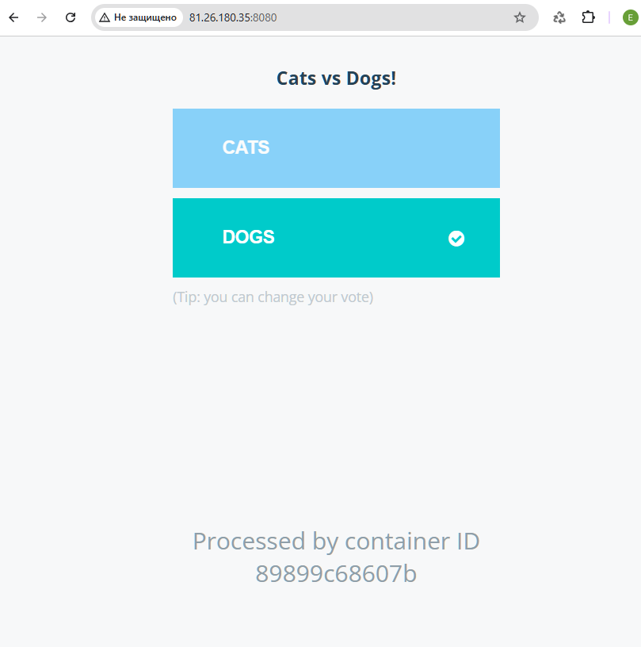
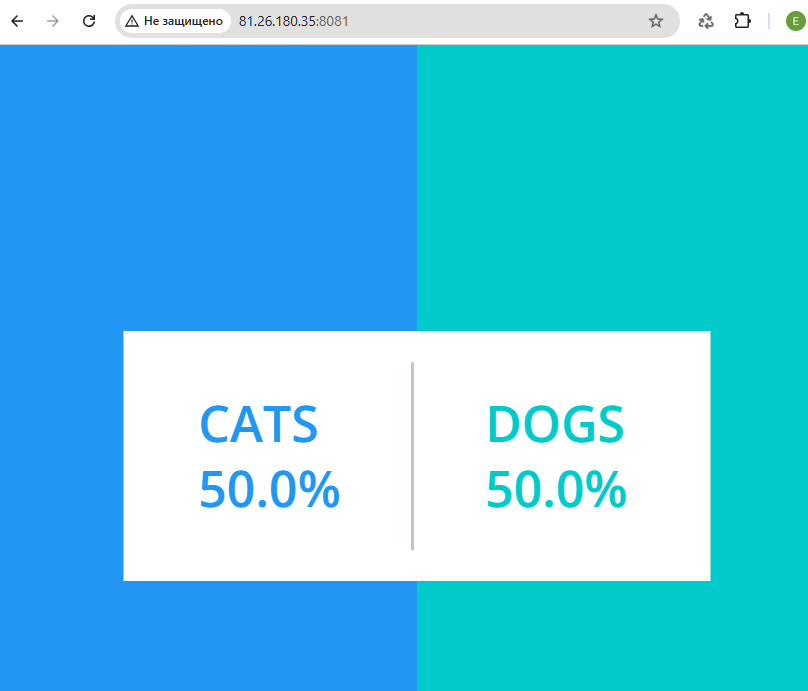

# Домашнее задание: Docker-Compose

## Цель
Описать и запустить микросервисное приложение с помощью docker-compose.

## Используемое приложение
[example-voting-app](https://github.com/dockersamples/example-voting-app) - распределенное приложение для голосования, состоящее из 5 микросервисов:
- **vote** (Python) - веб-интерфейс для голосования
- **result** (Node.js) - веб-интерфейс для просмотра результатов
- **worker** (.NET) - обработчик голосов
- **redis** - брокер сообщений для сбора голосов
- **postgres** - база данных для хранения результатов

---

## 1. Docker-compose.yml

```yaml
networks:
  voting-network:
    driver: bridge

volumes:
  postgres-data:
  redis-data:

services:
  postgres-db:
    image: postgres:15-alpine
    container_name: postgres-db
    environment:
      POSTGRES_USER: postgres
      POSTGRES_PASSWORD: postgres
      POSTGRES_DB: postgres
    volumes:
      - postgres-data:/var/lib/postgresql/data
    networks:
      - voting-network
    restart: always
    healthcheck:
      test: ["CMD", "pg_isready", "-U", "postgres"]
      interval: 10s
      timeout: 5s
      retries: 10

  redis:
    image: redis:alpine
    container_name: redis
    volumes:
      - redis-data:/data
    networks:
      - voting-network
    restart: always
    healthcheck:
      test: ["CMD", "redis-cli", "ping"]
      interval: 10s
      timeout: 5s
      retries: 10

  voting-app:
    image: otusteam.gitlab.yandexcloud.net:5050/devops/devops-2026-03/example-voting-app/voting-app:latest
    container_name: voting-app
    ports:
      - "8080:80"
    networks:
      - voting-network
    depends_on:
      redis:
        condition: service_healthy
    restart: always

  worker:
    image: otusteam.gitlab.yandexcloud.net:5050/devops/devops-2026-03/example-voting-app/worker-app:latest
    container_name: worker
    networks:
      - voting-network
    depends_on:
      redis:
        condition: service_healthy
      postgres-db:
        condition: service_healthy
    restart: always

  result-app:
    image: otusteam.gitlab.yandexcloud.net:5050/devops/devops-2026-03/example-voting-app/result-app:latest
    container_name: result-app
    ports:
      - "8081:80"
    networks:
      - voting-network
    depends_on:
      postgres-db:
        condition: service_healthy
    restart: always
```

---

## 2. Запуск на Yandex Cloud через docker-compose

### 2.1 Запуск

```bash
# Копирование docker-compose.yml на ВМ
scp -i ~/.ssh/id_ed25519_otus_yc docker-compose.yml yc-user@<VM_IP>:~/

# Подключение к ВМ
ssh -i ~/.ssh/id_ed25519_otus_yc yc-user@<VM_IP>

# Установка Docker
sudo apt update
sudo apt install -y docker.io docker-compose-v2
sudo systemctl enable --now docker
sudo usermod -aG docker $USER
newgrp docker

# Логин в GitLab Registry
 echo "glpat-токен" | docker login otusteam.gitlab.yandexcloud.net:5050 -u elm.g2016@yandex.ru --password-stdin 2>/dev/null

# Запуск
docker compose up -d
```

### 2.2 Результат запуска

```bash
yc-user@docker-vm:~$ docker compose up -d
WARN[0000] /home/yc-user/docker-compose.yml: the attribute `version` is obsolete, it will be ignored, please remove it to avoid potential confusion
[+] Running 6/6
 ✔ Network yc-user_voting-network  Created
 ✔ Container redis                 Healthy
 ✔ Container postgres-db           Healthy
 ✔ Container result-app            Started
 ✔ Container worker                Started
 ✔ Container voting-app            Started
```

### 2.4 Проверка статуса

```bash
yc-user@docker-vm:~$ docker compose ps
NAME          IMAGE                                                                                             COMMAND                  SERVICE       STATUS                        PORTS
postgres-db   postgres:15-alpine                                                                                "docker-entrypoint.s…"   postgres-db   Up (healthy)                   5432/tcp
redis         redis:alpine                                                                                      "docker-entrypoint.s…"   redis         Up (healthy)                   6379/tcp
result-app    otusteam.gitlab.yandexcloud.net:5050/devops/devops-2026-03/example-voting-app/result-app:latest   "/usr/bin/tini -- no…"   result-app    Up                             0.0.0.0:8081->80/tcp
voting-app    otusteam.gitlab.yandexcloud.net:5050/devops/devops-2026-03/example-voting-app/voting-app:latest   "gunicorn app:app -b…"   voting-app    Up                             0.0.0.0:8080->80/tcp
worker        otusteam.gitlab.yandexcloud.net:5050/devops/devops-2026-03/example-voting-app/worker-app:latest   "dotnet Worker.dll"      worker        Up
```

### 2.5 Внешний IP ВМ

```bash
yc-user@docker-vm:~$ curl ifconfig.me
81.26.180.35
```

---

## 3. Доступ к приложению

- **Приложение для голосования:** `http://81.26.180.35:8080`
- **Приложение для результатов:** `http://81.26.180.35:8081`

**Скриншот: Voting App в браузере**



**Скриншот: Result App в браузере**

