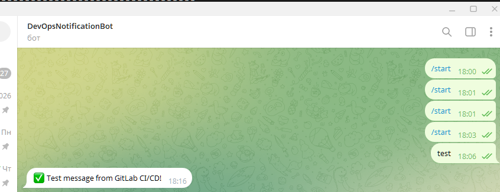
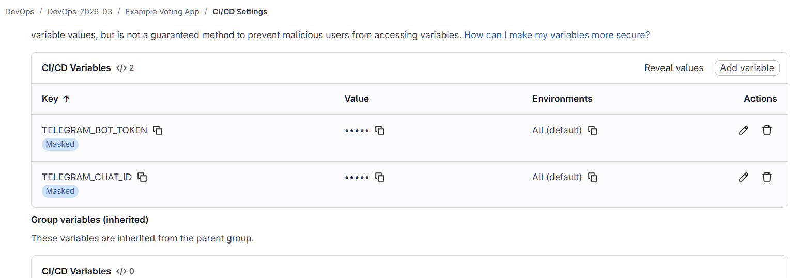
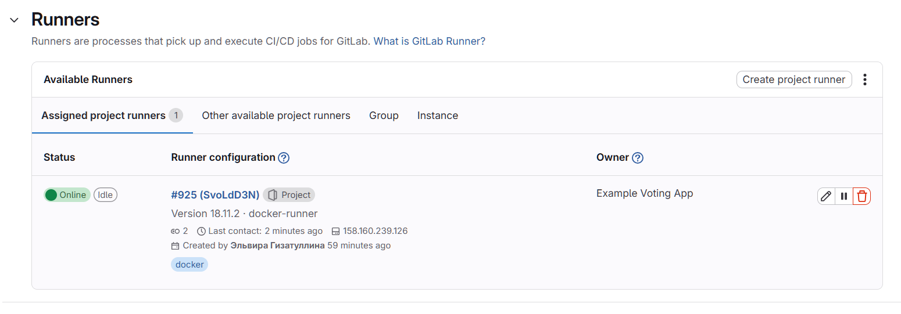
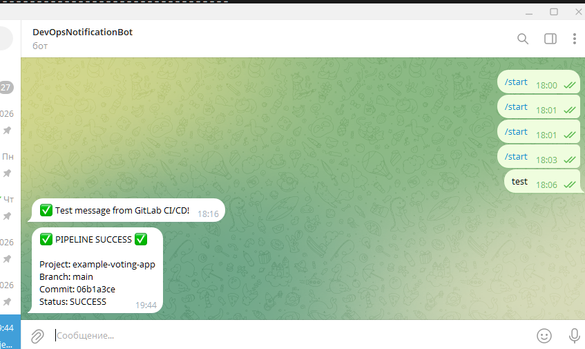
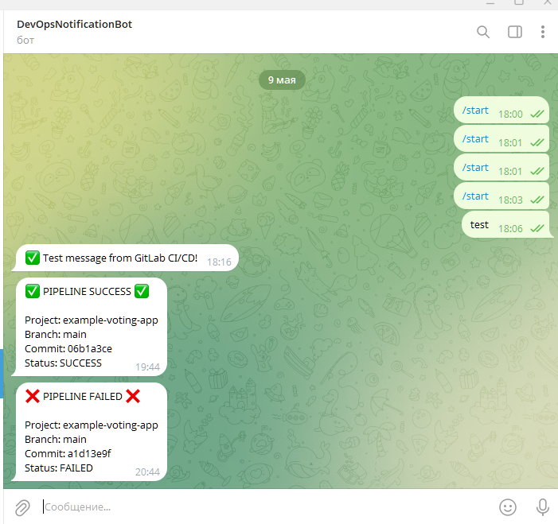

# Домашнее задание: Git && ChatOps

## Цель
Настроить pipeline в GitLab CI/CD с отправкой уведомлений о результате сборки в Telegram.

---

## 1. Создание Telegram бота

### 1.1 Создание бота через BotFather

В Telegram найти `@BotFather` и выполнить команды:

```
/newbot
Имя бота: DevOpsNotificationBot
Username: DevOpsNotification_Bot
```

**Результат:**
```
Done! Congratulations on your new bot. You will find it at t.me/DevOpsNotification_Bot

Use this token to access the HTTP API:
871********
```

### 1.2 Получение Chat ID

Отправить боту любое сообщение и выполнить запрос:

```bash
curl "https://api.telegram.org/bot871********/getUpdates"
```

**Результат:**
```json
{"ok":true,"result":[{"update_id":969058354,
"message":{"message_id":5,"from":{"id":1340441313,"is_bot":false,"first_name":"Elvira","username":"elv_1111","language_code":"ru"},"chat":{"id":1340441313,"first_name":"Elvira","username":"elv_1111","type":"private"},"date":1778339195,"text":"test"}}]}
```

**Полученные данные:**
- `TELEGRAM_BOT_TOKEN`: `871********`
- `TELEGRAM_CHAT_ID`: `1340441313`

### 1.3 Проверка отправки сообщения

```bash
curl -s -X POST "https://api.telegram.org/bot871********/sendMessage" \
  -d chat_id="1340441313" \
  -d text="✅ Test message from GitLab CI/CD!"
```

**Результат:**
```json
{"ok":true,"result":{"message_id":6,"from":{"id":8716533816,"is_bot":true,"first_name":"DevOpsNotificationBot","username":"DevOpsNotification_Bot"},"chat":{"id":1340441313,"first_name":"Elvira","username":"elv_1111","type":"private"},"date":1778339788,"text":"✅ Test message from GitLab CI/CD!"}}
```



---

## 2. Настройка переменных в GitLab CI/CD

В GitLab: **Settings → CI/CD → Variables**

| Variable | Value | Protected | Masked |
|----------|-------|-----------|--------|
| `TELEGRAM_BOT_TOKEN` | `871********` | ❌ No | ✅ Yes |
| `TELEGRAM_CHAT_ID` | `1340441313` | ❌ No | ✅ Yes |



---

## 3. Создание .gitlab-ci.yml

```yaml
stages:
  - test
  - notify

variables:
  TEST_VALUE: "10"

test_job:
  stage: test
  script:
    - |
      if [ $TEST_VALUE -ge 5 ]; then
        echo "✅ SUCCESS: Condition met ($TEST_VALUE >= 5)"
        echo "JOB_STATUS=success" > job.env
      else
        echo "❌ FAILED: Condition not met ($TEST_VALUE < 5)"
        echo "JOB_STATUS=failed" > job.env
        exit 1
      fi
  artifacts:
    reports:
      dotenv: job.env

telegram_notify:
  stage: notify
  needs: ["test_job"]
  script:
    - |
      if [ "$JOB_STATUS" = "success" ]; then
        MESSAGE="✅ PIPELINE SUCCESS ✅%0A%0AProject: ${CI_PROJECT_NAME}%0ABranch: ${CI_COMMIT_BRANCH}%0ACommit: ${CI_COMMIT_SHORT_SHA}%0AStatus: SUCCESS"
      else
        MESSAGE="❌ PIPELINE FAILED ❌%0A%0AProject: ${CI_PROJECT_NAME}%0ABranch: ${CI_COMMIT_BRANCH}%0ACommit: ${CI_COMMIT_SHORT_SHA}%0AStatus: FAILED"
      fi
      
      curl -s -X POST "https://api.telegram.org/bot${TELEGRAM_BOT_TOKEN}/sendMessage" \
        -d chat_id="${TELEGRAM_CHAT_ID}" \
        -d text="${MESSAGE}"
```

---

## 4. Настройка GitLab Runner

### 4.1 Установка GitLab Runner на ВМ

```bash
# Добавление официального репозитория GitLab Runner
curl -L "https://packages.gitlab.com/install/repositories/runner/gitlab-runner/script.deb.sh" | sudo bash

# Установка GitLab Runner
sudo apt install -y gitlab-runner

# Добавление пользователя gitlab-runner в группу docker
sudo usermod -aG docker gitlab-runner
```

### 4.2 Создание Project Runner

В GitLab: **Settings → CI/CD → Runners → Create project runner**

| Поле | Значение |
|------|----------|
| Tags | `docker` |
| Description | `docker-runner` |
| **Run untagged jobs** | ✅ |

После создания получен токен: `glrt-SvoLd*************.01.1b0zlkq27`

### 4.3 Регистрация runner на ВМ

```bash
sudo gitlab-runner register --url https://otusteam.gitlab.yandexcloud.net --token glrt-SvoLd*************.01.1b0zlkq27
```

**В процессе регистрации:**
```
Enter the GitLab instance URL: https://otusteam.gitlab.yandexcloud.net
Enter a name for the runner: docker-vm
Enter an executor: shell
```

### 4.4 Запуск runner

```bash
sudo systemctl start gitlab-runner
sudo systemctl enable gitlab-runner
```

### 4.5 Проверка статуса runner

```bash
sudo gitlab-runner list
```

**Результат:**
```
Runtime platform                                    arch=amd64 os=linux pid=20332 revision=68229485 version=18.11.2
Listing configured runners                          ConfigFile=/etc/gitlab-runner/config.toml
docker-vm                                           Executor=shell Token=glrt-SvoLdD3N... URL=https://otusteam.gitlab.yandexcloud.net
```



---

## 5. Запуск pipeline

### 5.1 Успешный сценарий (TEST_VALUE=10)

```bash
git add .gitlab-ci.yml
git commit -m "Add CI/CD pipeline with Telegram notifications"
git push
```

**Результат в GitLab:**
Pipeline запущен, job `test_job` успешен, `telegram_notify` отправляет уведомление.

**Логи runner:**
```
May 09 16:44:16 docker-vm gitlab-runner[4079]: Job succeeded duration_s=0.820014035 job-status=success
```

**Уведомление в Telegram:**



```
✅ PIPELINE SUCCESS ✅

Project: example-voting-app
Branch: main
Commit: 06b1a3ce
Status: SUCCESS
```

### 5.2 Неуспешный сценарий (TEST_VALUE=3)

Изменить в `.gitlab-ci.yml`:
```yaml
variables:
  TEST_VALUE: "3"
```

**Добавлена важная опция `when: always` для отправки уведомлений при провале:**

```yaml
telegram_notify:
  stage: notify
  needs: ["test_job"]
  when: always                    # <-- обязательно для отправки при failure
  script:
    - |
      if [ "$JOB_STATUS" = "success" ]; then
        MESSAGE="✅ PIPELINE SUCCESS ✅%0A%0AProject: ${CI_PROJECT_NAME}%0ABranch: ${CI_COMMIT_BRANCH}%0ACommit: ${CI_COMMIT_SHORT_SHA}%0AStatus: SUCCESS"
      else
        MESSAGE="❌ PIPELINE FAILED ❌%0A%0AProject: ${CI_PROJECT_NAME}%0ABranch: ${CI_COMMIT_BRANCH}%0ACommit: ${CI_COMMIT_SHORT_SHA}%0AStatus: FAILED"
      fi
      
      curl -s -X POST "https://api.telegram.org/bot${TELEGRAM_BOT_TOKEN}/sendMessage" \
        -d chat_id="${TELEGRAM_CHAT_ID}" \
        -d text="${MESSAGE}"
```

**Коммит и пуш:**
```bash
git add .gitlab-ci.yml
git commit -m 'Telegram notifications Test-2'
git push
```

**Логи runner при провале:**
```
May 09 17:11:05 docker-vm gitlab-runner[4079]: WARNING: Job failed: exit status 1
May 09 17:11:05 docker-vm gitlab-runner[4079]: WARNING: Submitting job to coordinator... job failed
```

**Уведомление в Telegram:**



```
❌ PIPELINE FAILED ❌

Project: example-voting-app
Branch: main
Commit: a1d13e9f
Status: FAILED
```

---

## 6. Полный список переменных CI/CD для уведомлений

| Переменная | Описание |
|------------|----------|
| `CI_PROJECT_NAME` | Имя проекта |
| `CI_PROJECT_URL` | URL проекта |
| `CI_COMMIT_BRANCH` | Название ветки |
| `CI_COMMIT_SHORT_SHA` | Короткий хеш коммита |
| `CI_COMMIT_AUTHOR` | Автор коммита |
| `CI_PIPELINE_URL` | Ссылка на pipeline |
| `CI_JOB_NAME` | Имя job |
| `CI_JOB_STATUS` | Статус job (success/failed) |

---

## Выводы

1. ✅ Создан Telegram бот и получен Chat ID
2. ✅ Настроены переменные в GitLab CI/CD
3. ✅ Установлен и зарегистрирован GitLab Runner
4. ✅ Написан .gitlab-ci.yml с условием if/else
5. ✅ Добавлена опция `when: always` для отправки уведомлений при провале
6. ✅ Настроена отправка уведомлений в Telegram об успехе и неудаче
7. ✅ Pipeline успешно выполняет задание и отправляет сообщения

---

## Итоговая структура репозитория

```
example-voting-app/
├── .gitlab-ci.yml
├── vote/
├── result/
├── worker/
├── docker-compose.yml
└── README.md
```