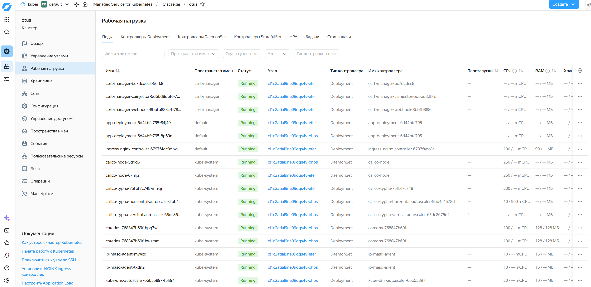
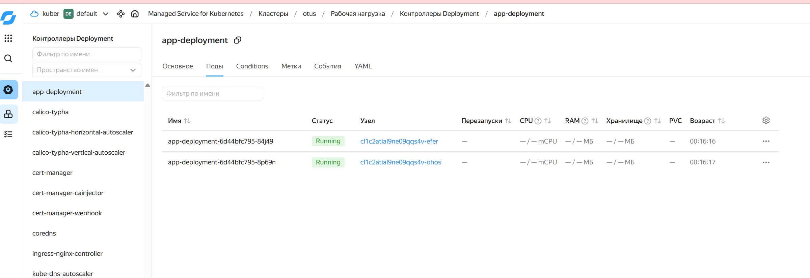
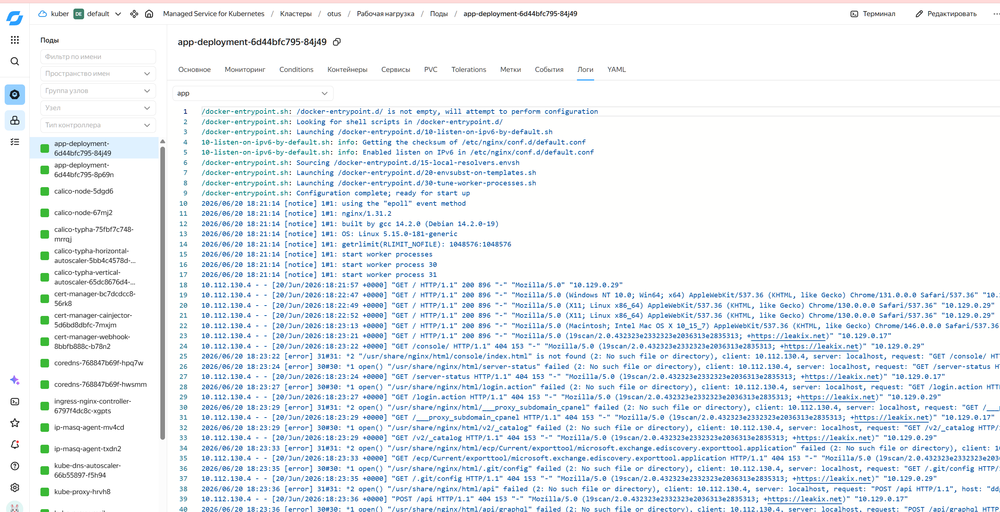
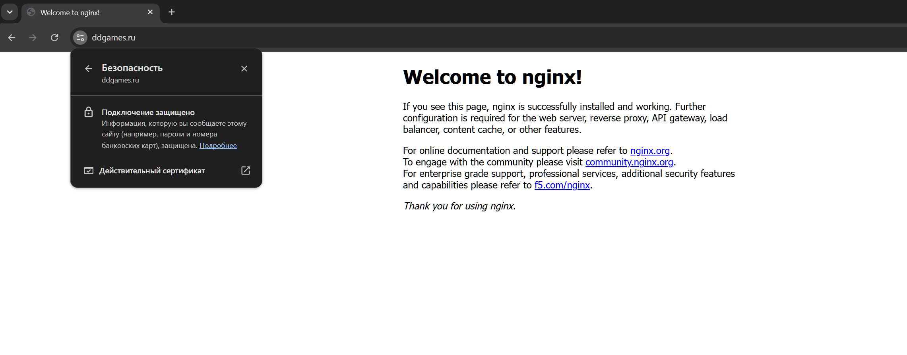
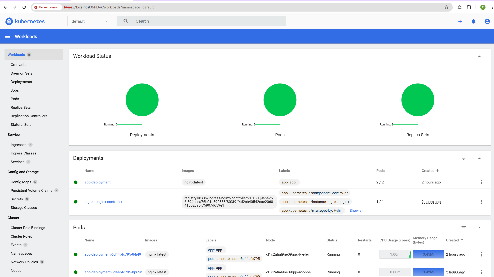
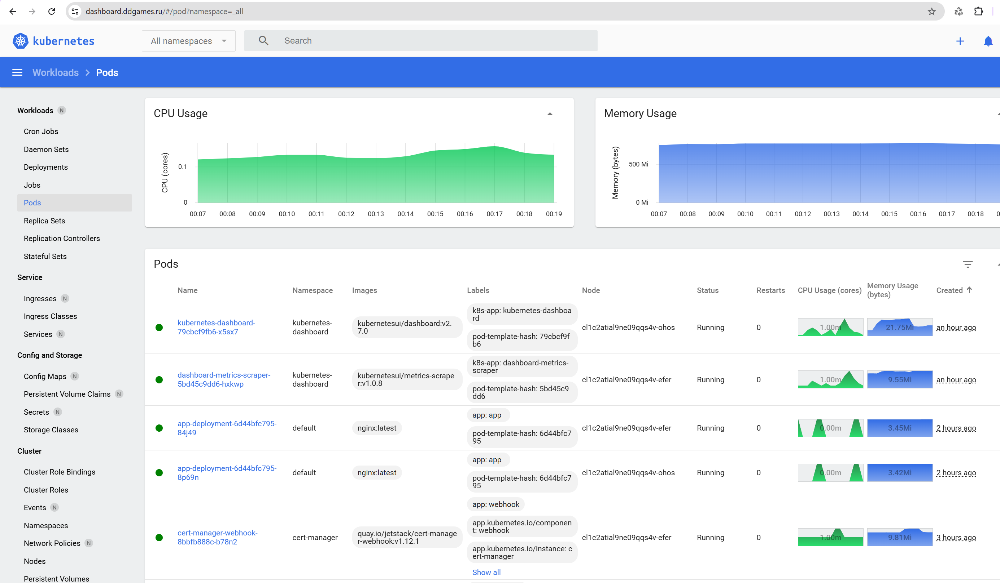

# Домашнее задание: Развертывание кластера Kubernetes

## Цель работы
Развернуть и настроить кластер Kubernetes.

## Описание/Пошаговая инструкция выполнения домашнего задания:
1) В данном ДЗ необходимо развернуть свой кластер Kubernetes.
2) Допустимо два варианта - managed kubernetes на Yandex.Cloud или установка компонентов на виртуальную машину самостоятельно. Результатом является Kubernetes c любым dashboard.
3) Предоставить доступ к кластеру через IAM в Yandex.Cloud для менторов, предоставить доступ к dashboard, либо к kubeconfig.

---

## 1. Развертывание кластера Kubernetes в Yandex Cloud

- **Тип:** Managed Service for Kubernetes
- **Версия Kubernetes:** v1.33.3
- **Количество узлов:** 2
- **Статус:** RUNNING, HEALTHY

**Команда для подключения:**
```bash
yc managed-kubernetes cluster get-credentials otus --external
```

**Результат проверки:**
```bash
$ kubectl get nodes
NAME                        STATUS   ROLES    AGE    VERSION
cl1c2atial9ne09qqs4v-efer   Ready    <none>   122m   v1.33.3
cl1c2atial9ne09qqs4v-ohos   Ready    <none>   123m   v1.33.3
```


*Рисунок 1 — Панель управления рабочими нагрузками Kubernetes*


*Рисунок 2 — Два запущенных пода приложения*


*Рисунок 3 — Логи контейнера Nginx*


*Рисунок 4 — Страница Nginx, доступная по HTTPS на домене ddgames.ru*

---

## Обновленный раздел 2 для README:

```markdown
## 2. Настройка доступа через IAM

### Сервисный аккаунт:
| Параметр | Значение |
|----------|----------|
| Имя | k8s-access |
| ID | aje4bctgsact99nd9im4 |
| Роли | iam.editor, k8s.cluster-api.editor, k8s.clusters.agent |

### Доступ для менторов (через IAM):
1. Сервисный аккаунт `k8s-access` добавлен в облако `kuber` (ID: `b1ghjvva4gf7ub2msh9n`)
2. Назначены роли: `iam.editor`, `k8s.cluster-api.editor`, `k8s.clusters.agent`

### Доступ для менторов через kubeconfig:

Для доступа к Dashboard и управления кластером создан ServiceAccount с правами `cluster-admin`:

```bash
# Создание ServiceAccount с полными правами
kubectl apply -f - <<EOF
apiVersion: v1
kind: ServiceAccount
metadata:
  name: mentor-access
  namespace: default
---
apiVersion: rbac.authorization.k8s.io/v1
kind: ClusterRoleBinding
metadata:
  name: mentor-access-binding
roleRef:
  apiGroup: rbac.authorization.k8s.io
  kind: ClusterRole
  name: cluster-admin
subjects:
- kind: ServiceAccount
  name: mentor-access
  namespace: default
EOF

# Получение токена
kubectl create token mentor-access -n default
```

**kubeconfig для ментора (`kubeconfig-mentor.yaml`):**

```yaml
apiVersion: v1
kind: Config
clusters:
- cluster:
    insecure-skip-tls-verify: true
    server: https://37.230.168.90
  name: yc-otus
contexts:
- context:
    cluster: yc-otus
    user: mentor
  name: mentor-context
current-context: mentor-context
users:
- name: mentor
  user:
    token: eyJhbG****************************kJA
```

**Проверка доступа:**
```bash
kubectl --kubeconfig kubeconfig-mentor.yaml get nodes
kubectl --kubeconfig kubeconfig-mentor.yaml get pods -A
kubectl --kubeconfig kubeconfig-mentor.yaml auth can-i '*' '*' --all-namespaces
```

**Вход в Dashboard:**
1. Открыть `https://dashboard.ddgames.ru`
2. Выбрать **Token**
3. Вставить токен из файла `kubeconfig-mentor.yaml`
4. Нажать **Sign in**

После входа ментор будет иметь полный доступ ко всем ресурсам кластера благодаря правам `cluster-admin`.


## 3. Развертывание приложения

### 3.1 Установка Helm
```bash
curl -fsSL -o get_helm.sh https://raw.githubusercontent.com/helm/helm/main/scripts/get-helm-3
chmod 700 get_helm.sh && ./get_helm.sh
```

### 3.2 Установка Ingress NGINX Controller
```bash
helm repo add ingress-nginx https://kubernetes.github.io/ingress-nginx
helm repo update
helm install ingress-nginx ingress-nginx/ingress-nginx \
  --namespace ingress-nginx \
  --create-namespace \
  --set controller.service.type=LoadBalancer \
  --set controller.service.externalTrafficPolicy=Local
```
**Результат:** External IP: `158.160.223.224`

### 3.3 Установка cert-manager
```bash
kubectl apply -f https://github.com/cert-manager/cert-manager/releases/download/v1.12.1/cert-manager.yaml
```

### 3.4 Настройка ClusterIssuer
```yaml
apiVersion: cert-manager.io/v1
kind: ClusterIssuer
metadata:
  name: yc-clusterissuer
spec:
  acme:
    server: https://acme-v02.api.letsencrypt.org/directory
    email: dendrino22@yandex.ru
    privateKeySecretRef:
      name: letsencrypt-prod
    solvers:
    - http01:
        ingress:
          class: nginx
```

### 3.5 Развертывание приложения

**Deployment:**
```yaml
apiVersion: apps/v1
kind: Deployment
metadata:
  name: app-deployment
  labels:
    app: app
spec:
  replicas: 2
  selector:
    matchLabels:
      app: app
  template:
    metadata:
      labels:
        app: app
    spec:
      containers:
      - name: app
        image: nginx:latest
        ports:
        - containerPort: 80
```

**Service:**
```yaml
apiVersion: v1
kind: Service
metadata:
  name: app
spec:
  selector:
    app: app
  ports:
    - protocol: TCP
      port: 80
      targetPort: 80
```

**Ingress:**
```yaml
apiVersion: networking.k8s.io/v1
kind: Ingress
metadata:
  name: ddgames-ingress
  annotations:
    cert-manager.io/cluster-issuer: "yc-clusterissuer"
spec:
  ingressClassName: nginx
  tls:
  - hosts:
    - ddgames.ru
    secretName: ddgames-tls
  rules:
  - host: ddgames.ru
    http:
      paths:
      - path: /
        pathType: Prefix
        backend:
          service:
            name: app
            port:
              number: 80
```

### 3.6 Результаты проверки

```bash
$ kubectl get pods
NAME                                        READY   STATUS    RESTARTS   AGE
app-deployment-6d44bfc795-84j49             1/1     Running   0          25s
app-deployment-6d44bfc795-8p69n             1/1     Running   0          24s
```

```bash
$ kubectl get ingress ddgames-ingress
NAME              CLASS   HOSTS        ADDRESS           PORTS     AGE
ddgames-ingress   nginx   ddgames.ru   158.160.223.224   80, 443   83s
```

```bash
$ kubectl get certificate ddgames-tls
NAME          READY   SECRET        AGE
ddgames-tls   True    ddgames-tls   105s
```

---

## 🔗 Доступ к кластеру

### Через Yandex Cloud CLI:
```bash
yc managed-kubernetes cluster get-credentials otus --external
```

### Через kubeconfig (для менторов):
Файл `kubeconfig-mentor.yaml` отправлен в личные сообщения.

Для проверки доступа выполните:
```bash
kubectl --kubeconfig kubeconfig-mentor.yaml get nodes
kubectl --kubeconfig kubeconfig-mentor.yaml get pods
```

Извините за неудобство. Вот новый пункт для README, который вы можете скопировать и дополнить:

---

## 4. Настройка Kubernetes Dashboard

### 4.1 Установка Dashboard

```bash
kubectl apply -f https://raw.githubusercontent.com/kubernetes/dashboard/v2.7.0/aio/deploy/recommended.yaml
```

### 4.2 Создание admin-user

```bash
kubectl apply -f - <<EOF
apiVersion: v1
kind: ServiceAccount
metadata:
  name: admin-user
  namespace: kubernetes-dashboard
---
apiVersion: rbac.authorization.k8s.io/v1
kind: ClusterRoleBinding
metadata:
  name: admin-user
roleRef:
  apiGroup: rbac.authorization.k8s.io
  kind: ClusterRole
  name: cluster-admin
subjects:
- kind: ServiceAccount
  name: admin-user
  namespace: kubernetes-dashboard
EOF
```

### 4.3 Получение токена

```bash
kubectl -n kubernetes-dashboard create token admin-user
```

### 4.4 Доступ к Dashboard

```bash
# Проброс порта
kubectl port-forward -n kubernetes-dashboard service/kubernetes-dashboard 8443:443 --address 0.0.0.0
```

Открыть в браузере: `https://localhost:8443`

Для входа использовать **Token** из пункта 4.3.

### 4.5 Скриншот




## 5. Ingress для Dashboard

Для доступа к Kubernetes Dashboard через внешний ip:

**Файл `dashboard-ingress.yaml`:**

```yaml
apiVersion: networking.k8s.io/v1
kind: Ingress
metadata:
  name: dashboard-ingress
  namespace: kubernetes-dashboard
  annotations:
    cert-manager.io/cluster-issuer: "yc-clusterissuer"
    nginx.ingress.kubernetes.io/backend-protocol: "HTTPS"
spec:
  ingressClassName: nginx
  tls:
  - hosts:
    - dashboard.ddgames.ru
    secretName: dashboard-tls
  rules:
  - host: dashboard.ddgames.ru
    http:
      paths:
      - path: /
        pathType: Prefix
        backend:
          service:
            name: kubernetes-dashboard
            port:
              number: 443
```

**Применение:**
```bash
kubectl apply -f dashboard-ingress.yaml
```

**Проверка:**
```bash
kubectl get ingress -n kubernetes-dashboard
kubectl get certificate -n kubernetes-dashboard
```

**Доступ:**
```
https://dashboard.ddgames.ru
```

Токен для входа:
```bash
kubectl -n kubernetes-dashboard create token admin-user
```


```

