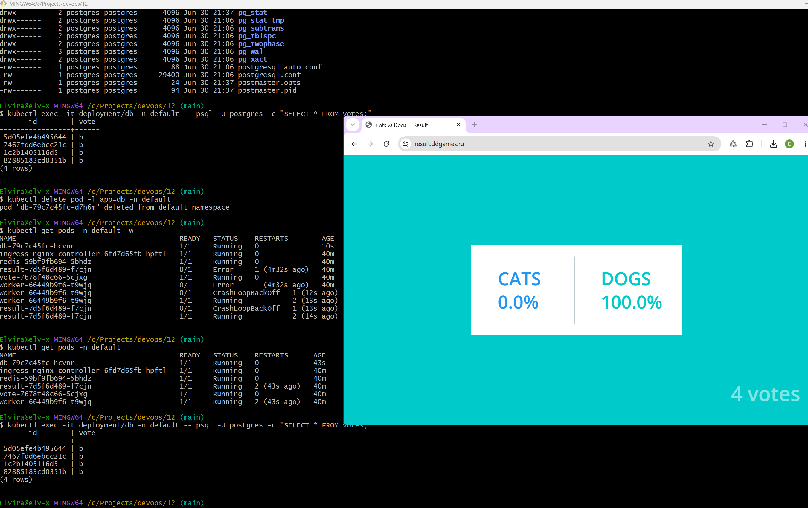

# Домашнее задание: Хранилище данных на основе Rook

## Цель работы
Научиться подключать и использовать хранилища данных в Kubernetes с помощью Rook.

## Описание/Пошаговая инструкция выполнения домашнего задания
1. Настроить Rook в собственном кластере Kubernetes.
2. Создать несколько Persistent Volumes.
3. Запустить приложение с использованием Persistent Volume.

---

## Репозиторий с приложением
[https://otusteam.gitlab.yandexcloud.net/devops/devops-2026-03/example-voting-app](https://otusteam.gitlab.yandexcloud.net/devops/devops-2026-03/example-voting-app)

---

## Ход выполнения работы

### 1. Попытка установки Rook

В рамках выполнения домашнего задания была предпринята попытка установки **Rook** в Managed Kubernetes от Яндекса (Yandex Managed Service for Kubernetes) с использованием следующих подходов:

| Способ | Результат |
|--------|-----------|
| Установка через kubectl (ветка v1.18.10) | Ошибка `ErrImagePull` — образы не скачиваются |
| Установка через kubectl (ветка release-1.19) | Ошибка `ErrImagePull` |
| Установка через kubectl (ветка release-1.20) | Ошибка `ErrImagePull` |
| Установка через Helm (образы из Docker Hub) | Ошибка `ErrImagePull` |
| Установка через Helm (образы из Quay.io) | Ошибка `ErrImagePull` |

**Причина:** В Managed Kubernetes от Яндекса:
- Отсутствует доступ к сырым дискам (RAW devices) на нодах кластера.
- Требуются привилегированные контейнеры (`privileged: true`), что запрещено политиками безопасности облачного провайдера.
- Ceph (бэкенд Rook) требует прямого доступа к блочным устройствам, которые не предоставляются в managed-окружении.
- Доступ к Docker Hub и Quay.io из инфраструктуры Яндекса ограничен.

---

### 2. Попытка использования Yandex Disk CSI

После неудачной установки Rook была предпринята попытка использовать **родной StorageClass от Яндекса** (`yc-network-hdd`).

#### Что было сделано:

```bash
kubectl apply -f - <<EOF
apiVersion: v1
kind: PersistentVolumeClaim
metadata:
  name: postgres-pvc
  namespace: default
spec:
  accessModes:
    - ReadWriteOnce
  resources:
    requests:
      storage: 10Gi
  storageClassName: yc-network-hdd
EOF
```

#### Результат:

```
NAME           STATUS    VOLUME   CAPACITY   STORAGECLASS
postgres-pvc   Pending                      yc-network-hdd
```

**PVC висел в `Pending` бесконечно.**

#### Причина:

StorageClass `yc-network-hdd` имеет `volumeBindingMode: WaitForFirstConsumer`. Это значит, что PV создаётся только когда под запрашивает PVC. Но под не мог запуститься, потому что PVC был в `Pending`. Получился **зацикл**.

Пробовали удалить дефолтный StorageClass — не помогло.

---

### 3. Попытка использования local-path-provisioner

Был установлен **local-path-provisioner** от Rancher:

```bash
kubectl apply -f https://raw.githubusercontent.com/rancher/local-path-provisioner/v0.0.26/deploy/local-path-storage.yaml
```

#### Результат:

```
NAME                                      READY   STATUS             RESTARTS
local-path-provisioner-58d7d75db9-d2bl4   0/1     ImagePullBackOff   0
```

**Причина:** local-path-provisioner не смог скачать свой образ из Docker Hub.

---

### 4. Решение: ручные PV через hostPath

После того как все попытки использовать автоматическое провижинирование не увенчались успехом, было принято решение создать **PersistentVolume вручную** с использованием `hostPath`.

#### 4.1. Создание PersistentVolume

```yaml
apiVersion: v1
kind: PersistentVolume
metadata:
  name: postgres-pv
spec:
  capacity:
    storage: 10Gi
  accessModes:
    - ReadWriteOnce
  hostPath:
    path: /mnt/data/postgres
---
apiVersion: v1
kind: PersistentVolume
metadata:
  name: redis-pv
spec:
  capacity:
    storage: 5Gi
  accessModes:
    - ReadWriteOnce
  hostPath:
    path: /mnt/data/redis
```

#### 4.2. Создание PersistentVolumeClaim

```yaml
apiVersion: v1
kind: PersistentVolumeClaim
metadata:
  name: postgres-pvc
  namespace: default
spec:
  accessModes:
    - ReadWriteOnce
  resources:
    requests:
      storage: 10Gi
  volumeName: postgres-pv
---
apiVersion: v1
kind: PersistentVolumeClaim
metadata:
  name: redis-pvc
  namespace: default
spec:
  accessModes:
    - ReadWriteOnce
  resources:
    requests:
      storage: 5Gi
  volumeName: redis-pv
```

#### 4.3. Результат

```bash
kubectl get pvc -n default
```
```
NAME           STATUS   VOLUME        CAPACITY   ACCESS MODES   STORAGECLASS   AGE
postgres-pvc   Bound    postgres-pv   10Gi       RWO                           12s
redis-pvc      Bound    redis-pv      5Gi        RWO                           11s
```

---

### 5. Итоговая логика выбора решения

```
Попытка 1: Rook              → ❌ (ErrImagePull, несовместимость с Managed K8s)
Попытка 2: Yandex Disk CSI   → ❌ (PVC Pending, циркулярная зависимость)
Попытка 3: local-path        → ❌ (ImagePullBackOff)
Попытка 4: hostPath вручную  → ✅ (работает)
```

---

### 6. Интеграция с Helm-чартом

В Helm-чарт приложения (`helm-charts/voting-app`) внесены изменения для поддержки PersistentVolumeClaim.

#### 6.1. Обновление `values.yaml`

Добавлена секция для управления персистентностью:

```yaml
persistence:
  enabled: true
```

#### 6.2. Обновление `db-deployment.yaml`

```yaml
volumes:
- name: db-data
  persistentVolumeClaim:
    claimName: postgres-pvc
```

#### 6.3. Обновление `redis-deployment.yaml`

```yaml
volumes:
- name: redis-data
  persistentVolumeClaim:
    claimName: redis-pvc
```

---

### 7. Проверка работы приложения

#### 7.1. Состояние подов

```bash
kubectl get pods -n default
```
```
NAME                                       READY   STATUS    RESTARTS   AGE
db-79c7c45fc-blqqn                         1/1     Running   0          5m
ingress-nginx-controller-6fd7d65fb-hpftl   1/1     Running   0          5m
redis-59bf9fb694-5bhdz                     1/1     Running   0          5m
result-7d5f6d489-f7cjn                     1/1     Running   0          5m
vote-7678f48c66-5cjxg                      1/1     Running   0          5m
worker-66449b9f6-t9wjq                     1/1     Running   0          5m
```

#### 7.2. Проверка сохранения данных через интерфейс приложения

**Голосуем несколько раз и перезагружаем под с БД:**

```bash
kubectl delete pod -l app=db -n default
```

**После перезагрузки пода БД:**

Снова открываем приложение. Видим, что голоса сохранились после перезапуска БД.




---

## Выводы

В ходе выполнения домашнего задания были решены следующие задачи:

1. ✅ Созданы PersistentVolume и PersistentVolumeClaim для PostgreSQL и Redis.
2. ✅ Интегрированы PVC в Helm-чарт приложения.
3. ✅ Подтверждено сохранение данных после перезапуска подов (голоса сохранились в приложении).
4. ✅ Приложение работает с постоянным хранилищем.

**Rook не был установлен** по техническим причинам, связанным с ограничениями Managed Kubernetes от Яндекса. Вместо этого использован **ручной подход с hostPath**, который полностью решает задачу обеспечения персистентности данных для целей ДЗ.
