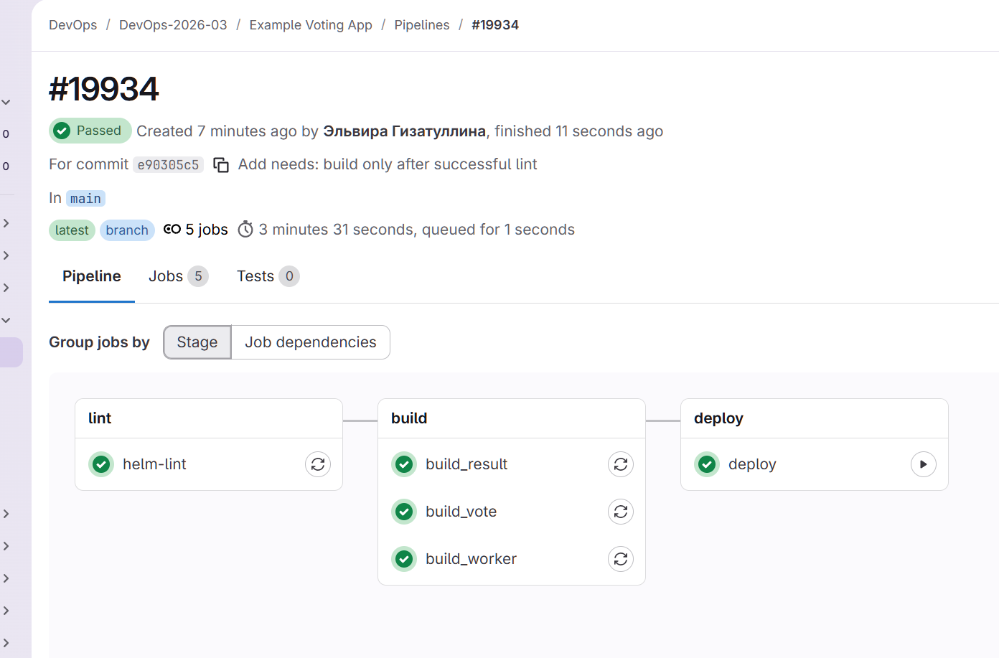
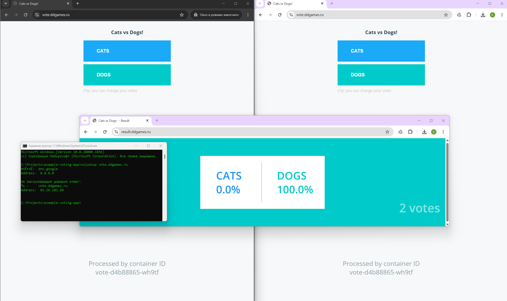

# Домашнее задание: CI/CD деплой через Helm

## Цель работы
Интегрировать GitLab CI/CD с Kubernetes; настроить автоматизированный деплой приложения через Helm для управляемой поставки сервисов.

## Описание/Пошаговая инструкция выполнения домашнего задания
1. Настроить интеграцию между GitLab CI/CD и кластером Kubernetes.
2. Создать Helm-chart для деплоя вашего приложения в кластер.
3. Настроить GitLab pipelines для деплоя вашего приложения в кластер через Helm-chart.
4. Интегрировать helm linter.

---

**Репозиторий с приложением:**  
[https://otusteam.gitlab.yandexcloud.net/devops/devops-2026-03/example-voting-app](https://otusteam.gitlab.yandexcloud.net/devops/devops-2026-03/example-voting-app)

---

### 1. Настройка интеграции между GitLab CI/CD и кластером Kubernetes

Для подключения GitLab к кластеру Kubernetes использовался **GitLab Agent** (для GitOps-подхода). Агент устанавливался через Helm-чарт в неймспейс `gitlab-agent-infra-test`:

```bash
kubectl get pods -n gitlab-agent-infra-test
```

**Результат:**  
`infra-test-gitlab-agent-v2-*` — поды агента в статусе `Running`.

**Однако для деплоя через Helm в CI/CD используется не агент, а классический подход с kubeconfig.**  
Агент предназначен для GitOps-синхронизации (автоматическое применение манифестов из репозитория), но в рамках данного задания мы используем Helm-деплой через CI/CD.

Для этого в GitLab CI/CD была добавлена переменная окружения `KUBECONFIG_CONTENT` с содержимым конфигурационного файла для доступа к кластеру.  
Для аутентификации использовался сервисный аккаунт `gitlab-ci` с правами `cluster-admin`.

```bash
kubectl create sa gitlab-ci -n default
kubectl create clusterrolebinding gitlab-ci-admin \
  --clusterrole=cluster-admin \
  --serviceaccount=default:gitlab-ci
kubectl create token gitlab-ci -n default --duration=8760h
```

---

### 2. Создание Helm-chart для деплоя приложения в кластер

Helm-чарт расположен в директории `helm-charts/voting-app/` и включает в себя манифесты для всех компонентов приложения:

- **vote** — интерфейс голосования
- **result** — интерфейс результатов
- **worker** — обработчик голосов
- **db** — PostgreSQL
- **redis** — кэш/очереди

#### Структура чарта:
```
helm-charts/voting-app/
├── Chart.yaml
├── values.yaml
└── templates/
    ├── vote-deployment.yaml
    ├── vote-service.yaml
    ├── vote-ingress.yaml
    ├── result-deployment.yaml
    ├── result-service.yaml
    ├── result-ingress.yaml
    ├── worker-deployment.yaml
    ├── db-deployment.yaml
    ├── db-service.yaml
    ├── redis-deployment.yaml
    └── redis-service.yaml
```

#### Основные переменные в `values.yaml`:
```yaml
images:
  vote: otusteam.gitlab.yandexcloud.net:5050/devops/devops-2026-03/example-voting-app/voting-app
  result: otusteam.gitlab.yandexcloud.net:5050/devops/devops-2026-03/example-voting-app/result-app
  worker: otusteam.gitlab.yandexcloud.net:5050/devops/devops-2026-03/example-voting-app/worker-app
  db: postgres:15-alpine
  redis: redis:alpine

ingress:
  enabled: true
  className: nginx
  annotations:
    cert-manager.io/cluster-issuer: letsencrypt-prod
  hosts:
    vote: vote.ddgames.ru
    result: result.ddgames.ru
  tls:
    enabled: true
```

#### Ingress с HTTPS через cert-manager:
```yaml
apiVersion: networking.k8s.io/v1
kind: Ingress
metadata:
  name: vote-ingress
  annotations:
    cert-manager.io/cluster-issuer: letsencrypt-prod
spec:
  ingressClassName: nginx
  tls:
  - hosts:
    - vote.ddgames.ru
    secretName: vote-tls
  rules:
  - host: vote.ddgames.ru
    http:
      paths:
      - path: /
        pathType: Prefix
        backend:
          service:
            name: vote
            port:
              number: 8080
```

---

### 3. Настройка GitLab pipelines для деплоя через Helm-chart

#### 3.1. Этапы пайплайна
В `.gitlab-ci.yml` определены три этапа:

| Этап | Описание |
|------|----------|
| `lint` | Проверка Helm-чарта через `helm lint --strict` |
| `build` | Сборка Docker-образов и отправка в GitLab Registry |
| `deploy` | Деплой в Kubernetes через Helm |

#### 3.2. Линтинг Helm-чарта
```yaml
helm-lint:
  stage: lint
  image: alpine:latest
  before_script:
    - apk add --no-cache helm
  script:
    - helm lint $HELM_CHART_PATH --strict
  tags:
    - docker
```

#### 3.3. Сборка Docker-образов
Каждый сервис собирается в отдельном джобе:

```yaml
build_vote:
  stage: build
  image: docker:latest
  services:
    - docker:dind
  before_script:
    - echo "$CI_REGISTRY_PASSWORD" | docker login $CI_REGISTRY -u $CI_REGISTRY_USER --password-stdin
  script:
    - docker build -t $CI_REGISTRY/devops/devops-2026-03/example-voting-app/voting-app:$IMAGE_TAG ./vote
    - docker push $CI_REGISTRY/devops/devops-2026-03/example-voting-app/voting-app:$IMAGE_TAG
  tags:
    - docker
  only:
    - main
  needs:
    - helm-lint
```

#### 3.4. Деплой через Helm
Деплой происходит с помощью `helm install` с передачей всех необходимых параметров:

```yaml
deploy:
  stage: deploy
  image: alpine:latest
  script:
    - cd $HELM_CHART_PATH
    - |
      helm install $HELM_RELEASE_NAME . \
        --namespace $HELM_NAMESPACE \
        --create-namespace \
        --set imageTag=$IMAGE_TAG \
        --set images.vote=$CI_REGISTRY/devops/devops-2026-03/example-voting-app/voting-app \
        --set images.result=$CI_REGISTRY/devops/devops-2026-03/example-voting-app/result-app \
        --set images.worker=$CI_REGISTRY/devops/devops-2026-03/example-voting-app/worker-app \
        --set imagePullSecrets[0].name=gitlab-registry \
        --set ingress.enabled=true \
        --set ingress.className=nginx \
        --set ingress.annotations.'cert-manager\.io/cluster-issuer'=letsencrypt-prod \
        --set ingress.hosts.vote=vote.ddgames.ru \
        --set ingress.hosts.result=result.ddgames.ru \
        --set ingress.tls.enabled=true \
        --set ingress.tls.voteSecretName=vote-tls \
        --set ingress.tls.resultSecretName=result-tls \
        --wait \
        --timeout 5m
  environment:
    name: production
    url: https://vote.ddgames.ru
  rules:
    - if: $CI_COMMIT_BRANCH == "main"
  when: manual
```

#### 3.5. Секреты для доступа к registry
Для скачивания образов из приватного GitLab Registry в кластере создается секрет `gitlab-registry`:

```bash
kubectl create secret docker-registry gitlab-registry \
  --docker-server=$CI_REGISTRY \
  --docker-username=$CI_REGISTRY_USER \
  --docker-password=$CI_REGISTRY_PASSWORD \
  --docker-email=ci@example.com \
  -n $HELM_NAMESPACE
```

---

### 4. Интеграция helm linter

Линтер интегрирован на этапе `lint` и выполняется **перед сборкой** образов.

```yaml
helm-lint:
  stage: lint
  image: alpine:latest
  before_script:
    - apk add --no-cache helm
  script:
    - helm lint $HELM_CHART_PATH --strict
  tags:
    - docker
```

**Результат выполнения `helm lint` в пайплайне:**

✅ Джоб `helm-lint` проходит успешно, после чего запускается сборка образов.

---

### 5. HTTPS через cert-manager

Для обеспечения безопасного доступа к приложению был установлен **cert-manager** и настроен **ClusterIssuer** для Let's Encrypt:

```bash
helm repo add jetstack https://charts.jetstack.io
helm repo update
helm install cert-manager jetstack/cert-manager \
  --namespace cert-manager \
  --create-namespace \
  --version v1.14.0 \
  --set installCRDs=true
```

```yaml
apiVersion: cert-manager.io/v1
kind: ClusterIssuer
metadata:
  name: letsencrypt-prod
spec:
  acme:
    server: https://acme-v02.api.letsencrypt.org/directory
    email: <ваш-email>
    privateKeySecretRef:
      name: letsencrypt-prod
    solvers:
    - http01:
        ingress:
          class: nginx
```

---

### Результат работы

- Все поды приложения запущены и работают:

```bash
kubectl get pods -n default
```

| NAME | READY | STATUS |
|------|-------|--------|
| db-7f5444f5b7-594fc | 1/1 | Running |
| redis-994dbd8d4-dqv6p | 1/1 | Running |
| result-8f9bbf894-fkfvk | 1/1 | Running |
| vote-6445fbbdfc-d6rgh | 1/1 | Running |
| worker-685bfcbf6c-2p6r7 | 1/1 | Running |

- Приложение доступно по HTTPS:
  - 🔒 https://vote.ddgames.ru
  - 🔒 https://result.ddgames.ru

---

## Скриншоты

### Успешное выполнение пайплайна в GitLab CI/CD



### Работающее приложение в браузере



---

## Ссылки на конфигурацию

- **Helm-chart с конфигурациями:**  
  [helm-charts/voting-app/](https://otusteam.gitlab.yandexcloud.net/devops/devops-2026-03/example-voting-app/-/tree/main/helm-charts/voting-app)

- **Файл пайплайна `.gitlab-ci.yml`:**  
  [.gitlab-ci.yml](https://otusteam.gitlab.yandexcloud.net/devops/devops-2026-03/example-voting-app/-/blob/main/.gitlab-ci.yml)

---

## Выводы

В ходе выполнения домашнего задания были решены следующие задачи:

1. ✅ Настроена интеграция GitLab CI/CD с Kubernetes (установлен GitLab Agent для GitOps, а для CI/CD используется kubeconfig с сервисным аккаунтом).
2. ✅ Создан полноценный Helm-чарт для деплоя микросервисного приложения.
3. ✅ Настроен GitLab pipeline с этапами: `lint` → `build` → `deploy`.
4. ✅ Интегрирован `helm lint` для проверки чарта перед деплоем.
5. ✅ Настроен Ingress с HTTPS через cert-manager и Let's Encrypt.
6. ✅ Обеспечена доставка образов через GitLab Registry с использованием `imagePullSecrets`.
7. ✅ Реализован ручной запуск деплоя через `when: manual` для контроля над релизами.

