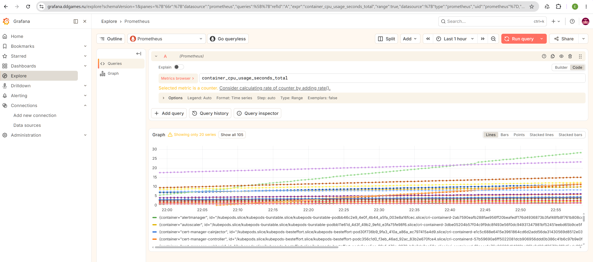
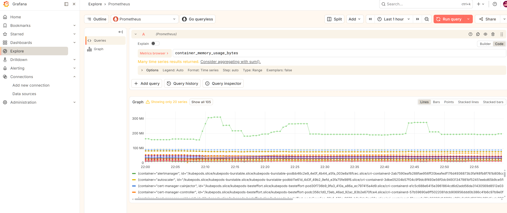
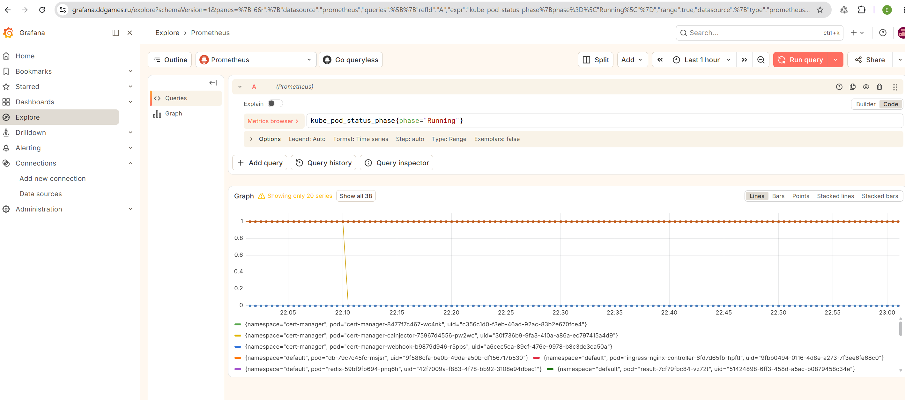
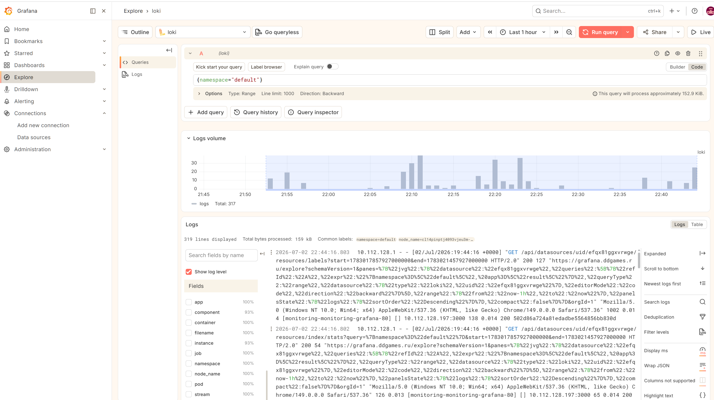
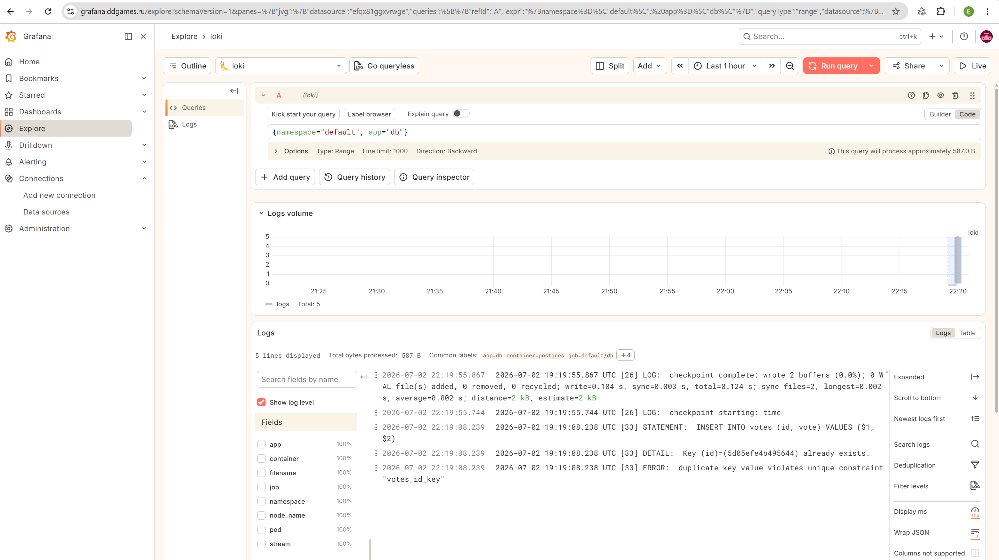
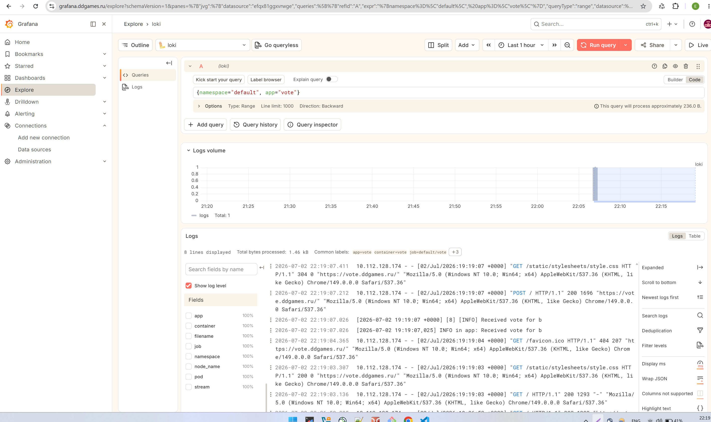

# Домашнее задание: Мониторинг и логирование в Kubernetes

## Цель работы
Интегрировать кластер Kubernetes с Grafana, Loki и Prometheus для сбора метрик и логов приложений.

## Описание/Пошаговая инструкция выполнения домашнего задания
1. Настроить интеграцию Kubernetes с Grafana/Loki/Prometheus для мониторинга и логирования приложения.
2. Предоставить ссылки и логин/пароль для доступа в дашборд.

---

## Репозиторий с приложением
[https://otusteam.gitlab.yandexcloud.net/devops/devops-2026-03/example-voting-app](https://otusteam.gitlab.yandexcloud.net/devops/devops-2026-03/example-voting-app)

---

## Ход выполнения работы

### 1. Установка Prometheus Stack (Prometheus + Grafana + Alertmanager)

#### 1.1. Добавление репозиториев

```bash
helm repo add prometheus-community https://prometheus-community.github.io/helm-charts
helm repo add grafana https://grafana.github.io/helm-charts
helm repo update
```

#### 1.2. Создание namespace

```bash
kubectl create namespace monitoring
```

#### 1.3. Установка kube-prometheus-stack

```bash
helm install monitoring prometheus-community/kube-prometheus-stack \
  --namespace monitoring \
  --set grafana.adminPassword=H***рр \
  --set grafana.service.type=ClusterIP \
  --set grafana.ingress.enabled=true \
  --set grafana.ingress.ingressClassName=nginx \
  --set grafana.ingress.hosts[0]=grafana.ddgames.ru \
  --set grafana.ingress.tls[0].hosts[0]=grafana.ddgames.ru \
  --set grafana.ingress.tls[0].secretName=grafana-tls
```

#### 1.4. Проверка статуса

```bash
kubectl get pods -n monitoring
```

**Результат:**
```
NAME                                                     READY   STATUS    RESTARTS   AGE
alertmanager-monitoring-kube-prometheus-alertmanager-0   2/2     Running   0          3m21s
monitoring-grafana-5cc7bc7684-phzk4                      3/3     Running   0          3m28s
monitoring-kube-prometheus-operator-59d5478755-p62s6     1/1     Running   0          3m28s
monitoring-kube-state-metrics-567d85f95f-pzcqg           1/1     Running   0          3m28s
monitoring-prometheus-node-exporter-9xtsm                1/1     Running   0          3m28s
prometheus-monitoring-kube-prometheus-prometheus-0       2/2     Running   0          3m21s
```

#### 1.5. Проверка Ingress

```bash
kubectl get ingress -n monitoring
```

**Результат:**
```
NAME                 CLASS   HOSTS                ADDRESS        PORTS     AGE
monitoring-grafana   nginx   grafana.ddgames.ru   81.26.182.60   80, 443   4m56s
```

---

### 2. Установка Loki (первая попытка через Helm)

```bash
helm install loki grafana/loki-stack \
  --namespace monitoring \
  --set grafana.enabled=false \
  --set prometheus.enabled=false \
  --set loki.persistence.enabled=true \
  --set loki.persistence.size=10Gi
```

**Результат:** Loki установлен, но возникли проблемы с персистентностью (PVC в Pending). После нескольких попыток настроить PV и PVC через hostPath, а также исправить права доступа (`securityContext`), Loki так и не запустился стабильно.

---

### 3. Установка Loki из Yandex Cloud Marketplace (финальное решение)

После неудачных попыток настроить Loki через Helm с персистентностью, было принято решение установить Loki через **Yandex Cloud Marketplace**. Это нативное решение для Managed Kubernetes в Яндекс.Облаке.

#### 3.1. Создание сервисного аккаунта для Loki

```bash
yc iam service-account create --name loki-sa
```

#### 3.2. Назначение прав на Object Storage

```bash
yc resource-manager folder add-access-binding <folder-id> \
  --role storage.uploader \
  --service-account-name loki-sa

yc resource-manager folder add-access-binding <folder-id> \
  --role storage.viewer \
  --service-account-name loki-sa
```

#### 3.3. Создание статического ключа доступа

```bash
yc iam access-key create \
  --service-account-name loki-sa \
  --format=json > sa-key.json
```

#### 3.4. Создание бакета в Object Storage

- **Консоль Yandex Cloud** → **Object Storage** → **Создать бакет**
- Имя: `loki-logs-2026-07-02`
- Доступ: **Приватный**

#### 3.5. Установка Loki через Marketplace

1. **Консоль Yandex Cloud** → **Managed Service for Kubernetes** → выбор кластера
2. Вкладка **Marketplace** → выбор приложения **Loki**
3. Настройки приложения:
   - Пространство имён: `loki`
   - Имя бакета: `loki-logs-2026-07-02`
   - Статический ключ: содержимое файла `sa-key.json`
   - Установить Promtail: включено
4. Нажать **Установить**

#### 3.6. Проверка установки Loki

```bash
kubectl get pods -n loki
```

**Результат:**
```
NAME                                                    READY   STATUS    RESTARTS   AGE
loki-loki-distributed-distributor-cd9455d9f-84g42       1/1     Running   0          60s
loki-loki-distributed-gateway-6fdc4fd86f-wndvk          1/1     Running   0          60s
loki-loki-distributed-ingester-0                        1/1     Running   0          59s
loki-loki-distributed-querier-0                         1/1     Running   0          60s
loki-loki-distributed-query-frontend-6c4c8f9975-5bb66   1/1     Running   0          60s
loki-promtail-njj24                                     1/1     Running   0          60s
```

---

### 4. Настройка источников данных в Grafana

#### 4.1. Доступ к Grafana

- **URL:** `https://grafana.ddgames.ru`
- **Логин:** `admin`
- **Пароль:** `H***рр`

#### 4.2. Добавление Prometheus

1. **Connections** → **Data sources** → **Add data source**
2. Выбрать **Prometheus**
3. URL: `http://monitoring-prometheus:9090`
4. **Save & Test**

#### 4.3. Добавление Loki (история с портом)

При добавлении Loki в Grafana возникла проблема: источник данных не подключался, выдавая ошибку `Unable to connect with Loki`.

**Диагностика:**
1. Проверка доступности Loki из пода Grafana через `wget` показала, что Loki отвечает.
2. Проверка сервиса Loki показала, что он слушает на **80 порту**, а не на стандартном 3100:

```bash
kubectl get svc -n loki | grep gateway
```

**Вывод:**
```
loki-loki-distributed-gateway   ClusterIP   10.96.217.15   <none>   80/TCP   6m55s
```

**Решение:** В настройках источника данных в Grafana был указан правильный порт:

```
http://loki-loki-distributed-gateway.loki.svc.cluster.local:80
```

После этого подключение успешно установилось.

---

### 5. Проверка работы

#### 5.1. Проверка метрик в Prometheus

Для проверки сбора метрик в Prometheus были выполнены следующие запросы в интерфейсе Grafana (раздел Explore, источник данных Prometheus):

**Запрос 1: Использование CPU контейнерами**
```promql
container_cpu_usage_seconds_total
```

**Запрос 2: Использование памяти контейнерами**
```promql
container_memory_usage_bytes
```

**Запрос 3: Количество запущенных подов**
```promql
kube_pod_status_phase{phase="Running"}
```

Все запросы успешно выполнились, метрики отображаются в Grafana.

#### 5.2. Проверка логов в Loki

Для проверки сбора логов в Loki были выполнены следующие запросы в интерфейсе Grafana (раздел Explore, источник данных Loki):

```logql
{namespace="default"}
{app="db"}
{app="vote"}
{app="result"}
```

Логи успешно отображаются в Grafana через источник данных Loki. Примеры логов приложений представлены на скриншотах ниже.

---

## Скриншоты

### Метрики Prometheus





### Логи в Loki





---

## Ссылки

- **Grafana:** [https://grafana.ddgames.ru](https://grafana.ddgames.ru)
- **Логин:** `admin`
- **Пароль:** `H***рр`

---

## Выводы

В ходе выполнения домашнего задания были решены следующие задачи:

1. ✅ Установлен Prometheus Stack (Prometheus + Grafana + Alertmanager) через Helm.
2. ✅ Настроен доступ к Grafana через Ingress с HTTPS.
3. ✅ Установлен Loki из Yandex Cloud Marketplace с хранением логов в Object Storage.
4. ✅ Настроены источники данных в Grafana (Prometheus и Loki).
5. ✅ Проверен сбор метрик приложения через Prometheus.
6. ✅ Проверен сбор логов приложения через Loki.
7. ✅ Предоставлены ссылки и логин/пароль для доступа к дашборду.

