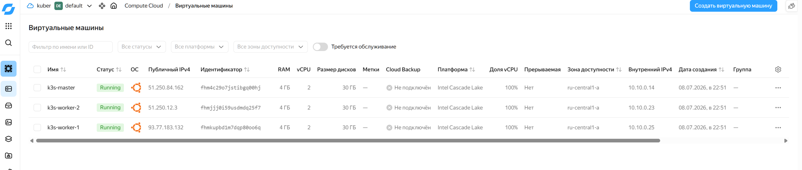
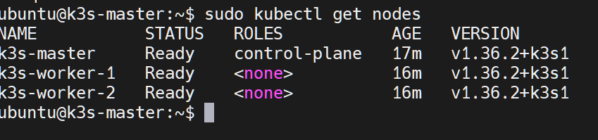

# Домашнее задание: Описание инфраструктуры через Terraform

## Цель работы
Оформить текущую инфраструктуру приложения в Yandex.Cloud с помощью Terraform.

## Описание/Пошаговая инструкция выполнения домашнего задания
1. Описать текущую инфраструктуру для приложения в Yandex.Cloud при помощи Terraform.
2. Все файлы конфигурации Terraform должны быть в репозитории.
3. Добавить описание создаваемых компонентов в README репозитория.
4. Приложить `tfstate`.

---

## Репозиторий с конфигурацией
[https://otusteam.gitlab.yandexcloud.net/devops/devops-2026-03/example-voting-app](https://otusteam.gitlab.yandexcloud.net/devops/devops-2026-03/example-voting-app)

---

## Настройка Yandex Cloud CLI и Terraform на Headless-сервере

Репозиторий содержит конфигурацию инфраструктуры на базе Terraform для развертывания приложения в Yandex Cloud (сеть, подсети, группы безопасности и виртуальные машины Compute Cloud).

Данное руководство описывает, как была решена проблема авторизации в облаке без использования веб-браузера на изолированном сервере Ubuntu (ubuntu-server-2024-tmpl), а также исправлены ошибки путей внутри манифестов Terraform.

---

## Решенные проблемы и хронология настройки

### 1. Авторизация Yandex Cloud CLI (yc) без браузера

При попытке выполнить стандартную инициализацию `yc init --no-browser` из-под корпоративной Федерации удостоверений (Single Sign-On), процесс завершался ошибкой:

```
ERROR: federation id authentication is not supported on this system because the browser can not be opened
```

**Решение:** Переход на использование Сервисного аккаунта вместо личного профиля, что является лучшей практикой для серверов и CI/CD:

1. В консоли управления Yandex Cloud (на рабочем ПК с браузером) в разделе IAM был создан сервисный аккаунт с необходимыми ролями (`editor`, `vpc.admin`).
2. Был сгенерирован и скачан авторизованный ключ в формате JSON.
3. Содержимое файла сохранено на сервере по пути `~/authorized_key.json`.
4. На сервере создан и активирован автономный профиль:

```bash
yc config profile create sa-profile
yc config set service-account-key ~/authorized_key.json
yc config set folder-id b1gbn838hak225v90cdu
yc config set cloud-id b1ghjvva4gf7ub2msh9n
```

---

### 2. Очистка вывода терминала (Удаление WARNING)

Так как сервер находится в изолированном окружении, команда `yc` постоянно выдавала желтое предупреждение о невозможности проверить обновления утилиты.

**Решение:** В файл профиля командной оболочки пользователя добавлена переменная окружения, которая полностью глушит технические предупреждения `yc`:

```bash
echo 'export YC_CLI_INITIALIZATION_SILENCE=true' >> ~/.bashrc
source ~/.bashrc
```

---

### 3. Исправление авторизации провайдера Yandex Cloud в Terraform

Изначально в `providers.tf` использовался блок `token = file("sa-key.json")`, в который передавался статический ключ доступа (S3 Static Access Key), что вызывало ошибку `OAuth token is invalid or expired`.

**Решение:** Конфигурация провайдера была переписана на использование полноценного авторизованного JSON-ключа сервисного аккаунта через директиву `service_account_key_file`.

**Текущий рабочий вид файла `providers.tf`:**

```hcl
terraform {
  required_providers {
    yandex = {
      source  = "yandex-cloud/yandex"
      version = "~> 0.90"
    }
  }
}

provider "yandex" {
  service_account_key_file = "authorized_key.json"
  cloud_id                 = var.cloud_id
  folder_id                = var.folder_id
  zone                     = var.zone
}
```

---

### 4. Исправление путей до SSH-ключей в Terraform

При генерации плана `terraform plan` возникала ошибка:

```
Invalid value for "path" parameter: no file exists at "~/.ssh/id_rsa.pub"
```

**Решение:** Функция `file()` в Terraform не умеет интерпретировать символ тильды (`~`) как домашнюю директорию.

1. На сервере была сгенерирована валидная пара SSH-ключей для пользователя `elv`:

```bash
ssh-keygen -t rsa -b 4096 -N "" -f ~/.ssh/id_rsa
```

2. Путь к публичному ключу в переменных Terraform был изменен с относительного (`~/.ssh/...`) на строгий абсолютный путь: `/home/elv/.ssh/id_rsa.pub`.

---

## Создаваемые ресурсы

| Ресурс | Количество | Описание |
|--------|------------|----------|
| VPC сеть | 1 | `voting-app-network` |
| Подсеть | 1 | `voting-app-subnet` (10.10.0.0/24) |
| Security Group | 1 | `voting-app-sg` (SSH, K3s API, NodePorts) |
| ВМ (мастер) | 1 | `k3s-master` (2 vCPU, 4GB RAM, 30GB HDD) |
| ВМ (воркеры) | 2 | `k3s-worker-1`, `k3s-worker-2` (2 vCPU, 4GB RAM, 30GB HDD) |

### Схема сетевой архитектуры

```
┌─────────────────────────────────────────────────────────────────────────┐
│                         Yandex Cloud                                    │
│  ┌───────────────────────────────────────────────────────────────────┐  │
│  │                   VPC: voting-app-network                        │  │
│  │  ┌────────────────────────────────────────────────────────────┐  │  │
│  │  │           Subnet: voting-app-subnet (10.10.0.0/24)        │  │  │
│  │  │  ┌──────────────┐  ┌──────────────┐  ┌──────────────┐    │  │  │
│  │  │  │  k3s-master  │  │ k3s-worker-1 │  │ k3s-worker-2 │    │  │  │
│  │  │  │   (master)   │  │   (worker)   │  │   (worker)   │    │  │  │
│  │  │  │ 10.10.0.10   │  │  10.10.0.11  │  │  10.10.0.12  │    │  │  │
│  │  │  └──────┬───────┘  └──────┬───────┘  └──────┬───────┘    │  │  │
│  │  │         │                 │                 │            │  │  │
│  │  │         └─────────────────┼─────────────────┘            │  │  │
│  │  │                           │                              │  │  │
│  │  │              Security Group: voting-app-sg               │  │  │
│  │  │    (SSH:22, K3s API:6443, NodePorts:30000-32767)        │  │  │
│  │  └────────────────────────────────────────────────────────────┘  │  │
│  └───────────────────────────────────────────────────────────────────┘  │
└─────────────────────────────────────────────────────────────────────────┘
```

---

## Запуск

На данный момент инфраструктурный манифест полностью валиден, провайдер успешно авторизуется в Yandex Cloud через ключ `authorized_key.json`, а граф зависимостей ресурсов строится корректно.

Для применения конфигурации и развертывания сети, подсетей, правил доступа и ВМ (master и worker), выполните в папке `~/terraform-infra`:

```bash
# Инициализация и обновление плагинов
terraform init -upgrade

# Проверка создаваемых ресурсов (План)
terraform plan -var="public_key_path=/home/elv/.ssh/id_rsa.pub"

# Применение конфигурации в облаке
terraform apply -var="public_key_path=/home/elv/.ssh/id_rsa.pub"
```

---

## Результат применения Terraform

### План изменений (terraform plan)

```bash
terraform plan -var="public_key_path=/home/elv/.ssh/id_rsa.pub"
```

План показал создание 10 ресурсов:

- 1 VPC сеть (`yandex_vpc_network.app_network`)
- 1 подсеть (`yandex_vpc_subnet.app_subnet`)
- 1 Security Group (`yandex_vpc_security_group.app_sg`)
- 1 мастер-нода (`yandex_compute_instance.master`)
- 2 воркер-ноды (`yandex_compute_instance.worker[0]`, `yandex_compute_instance.worker[1]`)
- 4 null_resource для установки k3s

### Выводы после применения (terraform apply)

```bash
terraform apply -auto-approve -var="public_key_path=/home/elv/.ssh/id_rsa.pub"
```

```
Apply complete! Resources: 7 added, 0 changed, 0 destroyed.

Outputs:

kubeconfig_command = "ssh ubuntu@51.250.84.162 sudo cat /etc/rancher/k3s/k3s.yaml"
master_ip = "51.250.84.162"
worker_ips = [
  "93.77.183.132",
  "51.250.12.3",
]
```

### Проверка кластера

```bash
ssh ubuntu@51.250.84.162
sudo kubectl get nodes
```

```
NAME           STATUS   ROLES           AGE   VERSION
k3s-master     Ready    control-plane   17m   v1.36.2+k3s1
k3s-worker-1   Ready    <none>          16m   v1.36.2+k3s1
k3s-worker-2   Ready    <none>          16m   v1.36.2+k3s1
```




### Исправления в процессе работы

**Ошибка 1: Неверный ID образа Ubuntu**
```
Error: rpc error: code = NotFound desc = Image "fd8e0hsg8g5spl5sv8ls" not found
```
→ ID образа заменён на актуальный: `fd806c8slu9j1pa87msc`

**Ошибка 2: Ошибка в Security Group**
```
Error: cannot set from_port/to_port with port
```
→ Правило для NodePort исправлено на `from_port` / `to_port`

**Ошибка 3: Путь до SSH-ключа**
```
Invalid value for "path" parameter: no file exists at "~/.ssh/id_rsa.pub"
```
→ Использован абсолютный путь: `/home/elv/.ssh/id_rsa.pub`

---

## Получение kubeconfig для удалённого доступа

Для работы с кластером с сервера Ubuntu необходимо скопировать kubeconfig и заменить IP на публичный:

```bash
scp ubuntu@51.250.84.162:/etc/rancher/k3s/k3s.yaml ~/.kube/config
sed -i 's/127.0.0.1/51.250.84.162/g' ~/.kube/config
```

---

## Структура файлов

```
terraform-infra/
├── providers.tf          # Провайдер Yandex.Cloud (service_account_key_file)
├── variables.tf          # Объявление переменных
├── terraform.tfvars      # Значения переменных (НЕ КОММИТИТЬ)
├── vpc.tf                # VPC сеть и подсеть
├── security-group.tf     # Правила файрвола
├── vms.tf                # Виртуальные машины (master + 2 workers)
├── k3s.tf                # Установка k3s на ВМ
├── outputs.tf            # Вывод IP-адресов
├── .gitignore            # Исключение чувствительных файлов
├── authorized_key.json   # Ключ сервисного аккаунта (НЕ КОММИТИТЬ)
└── terraform.tfstate     # Состояние инфраструктуры (прилагается к ДЗ)
```

---

## Выводы

В ходе выполнения домашнего задания были решены следующие задачи:

1. ✅ Установлен Terraform и Yandex Cloud CLI на Ubuntu 24.04.
2. ✅ Настроена авторизация через сервисный аккаунт без браузера.
3. ✅ Созданы Terraform-манифесты для описания инфраструктуры.
4. ✅ Исправлены ошибки авторизации и путей к SSH-ключам.
5. ✅ Создана VPC сеть, подсеть и Security Group.
6. ✅ Развернуты 3 ВМ (1 мастер + 2 воркера).
7. ✅ Настроена автоматическая установка k3s через `null_resource`.
8. ✅ Создан файл `terraform.tfstate` (приложен к ДЗ).
