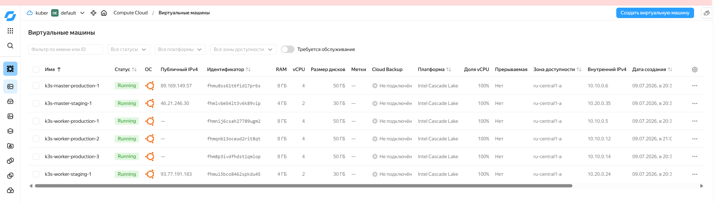

# Домашнее задание: Создание окружений через Terraform

## Цель работы
Настроить создание окружений через Terraform для управляемого и воспроизводимого развертывания инфраструктуры.

## Описание/Пошаговая инструкция выполнения домашнего задания
1. Настроить несколько окружений, создающихся через Terraform (staging/production).
2. Все файлы конфигурации Terraform должны быть в репозитории.
3. Добавить описание создаваемых компонентов в README репозитория.
4. Указывать каким образом была осуществлена привязка окружений к коду.
5. Приложить `tfstate`.

---

## Решение: создание окружений через Terraform Workspaces

Для разделения окружений **staging** и **production** используется механизм **Terraform Workspaces**. Это позволяет использовать один и тот же код с разными конфигурациями.

### Привязка окружений к коду

1. **Переменная `environment`** в `terraform.tfvars` определяет окружение.
2. **Все ресурсы** имеют суффикс с названием окружения:
   - `voting-app-network-staging`
   - `voting-app-network-production`
3. **Разные файлы переменных** для каждого окружения:
   - `environments/staging/terraform.tfvars`
   - `environments/production/terraform.tfvars`
4. **Terraform Workspaces** разделяют состояние:
   - `terraform workspace select staging`
   - `terraform workspace select production`

### Структура проекта

```
terraform/
├── authorized_key.json
├── backend.tf
├── environments/
│   ├── production/
│   │   └── terraform.tfvars
│   └── staging/
│       └── terraform.tfvars
├── main.tf
├── outputs.tf
├── terraform.tfstate.d/
│   ├── production/
│   │   ├── terraform.tfstate
│   │   └── terraform.tfstate.backup
│   └── staging/
│       ├── terraform.tfstate
│       └── terraform.tfstate.backup
├── variables.tf
└── versions.tf
```

---

## Создаваемые ресурсы

| Ресурс | Staging | Production |
|--------|---------|------------|
| **VPC сеть** | `voting-app-network-staging` | `voting-app-network-production` |
| **Подсеть** | `voting-app-subnet-staging` (10.20.0.0/24) | `voting-app-subnet-production` (10.10.0.0/24) |
| **Security Group** | `voting-app-sg-staging` | `voting-app-sg-production` |
| **Мастер-нода** | 1 (2 vCPU, 4 GB RAM, 30 GB) | 1 (4 vCPU, 8 GB RAM, 50 GB) |
| **Воркер-ноды** | 1 (2 vCPU, 4 GB RAM, 30 GB) | 3 (4 vCPU, 8 GB RAM, 50 GB) |

---

## Команды для управления окружениями

### Staging окружение

```bash
# Переключиться на staging
terraform workspace select staging

# Проверить план
terraform plan -var-file="environments/staging/terraform.tfvars"

# Применить изменения
terraform apply -var-file="environments/staging/terraform.tfvars"

# Удалить окружение
terraform destroy -var-file="environments/staging/terraform.tfvars"
```

### Production окружение

```bash
# Переключиться на production
terraform workspace select production

# Проверить план
terraform plan -var-file="environments/production/terraform.tfvars"

# Применить изменения
terraform apply -var-file="environments/production/terraform.tfvars"

# Удалить окружение
terraform destroy -var-file="environments/production/terraform.tfvars"
```

### Проверка текущего окружения

```bash
terraform workspace show
```

---

## Результат применения Terraform

### Staging окружение

```bash
terraform workspace select staging
terraform apply -auto-approve -var-file="environments/staging/terraform.tfvars"
```

**Результат:**
```
Apply complete! Resources: 5 added, 0 changed, 0 destroyed.

Outputs:
cluster_name = "k3s-cluster-staging"
environment = "staging"
master_ip = "46.21.246.30"
worker_ips = [
  "93.77.191.183",
]
```

### Production окружение

```bash
terraform workspace select production
terraform apply -auto-approve -var-file="environments/production/terraform.tfvars"
```

**Результат:**
```
Apply complete! Resources: 5 added, 0 changed, 0 destroyed.

Outputs:
cluster_name = "k3s-cluster-production"
environment = "production"
master_ip = "89.169.149.57"
worker_ips = [
  "",
  "",
  "",
]
```

---

## Скриншоты

### Виртуальные машины в Yandex Cloud



---

## Получение kubeconfig для доступа к кластеру

### Staging
```bash
ssh ubuntu@46.21.246.30 sudo cat /etc/rancher/k3s/k3s.yaml > ~/.kube/config
sed -i 's/127.0.0.1/46.21.246.30/g' ~/.kube/config
kubectl get nodes
```

### Production
```bash
ssh ubuntu@89.169.149.57 sudo cat /etc/rancher/k3s/k3s.yaml > ~/.kube/config
sed -i 's/127.0.0.1/89.169.149.57/g' ~/.kube/config
kubectl get nodes
```

---

## Файлы конфигурации

| Файл | Описание |
|------|----------|
| `versions.tf` | Версии Terraform и провайдера |
| `backend.tf` | Настройка хранения состояния (локальное) |
| `variables.tf` | Объявление переменных |
| `main.tf` | Основная конфигурация ресурсов |
| `outputs.tf` | Вывод информации после применения |
| `environments/staging/terraform.tfvars` | Переменные для staging |
| `environments/production/terraform.tfvars` | Переменные для production |
| `authorized_key.json` | Ключ сервисного аккаунта (не коммитится) |


