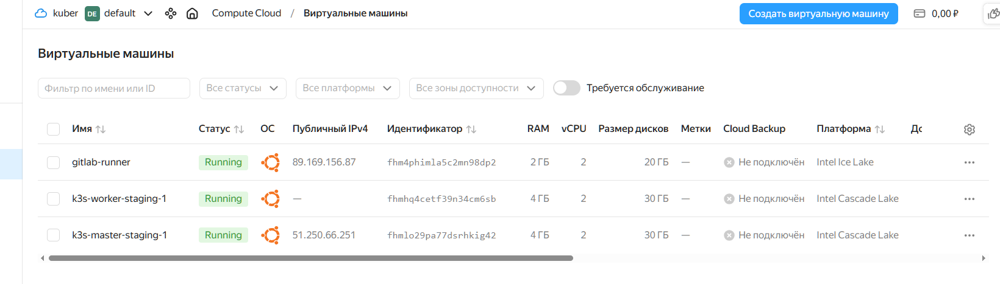
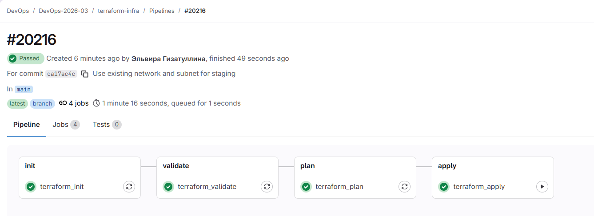

# Домашнее задание: Автоматизация Terraform

## Цель работы
Настроить запуск Terraform-конфигураций через GitLab CI/CD для автоматизированного развертывания и управления инфраструктурой.

---

## Репозиторий с конфигурацией
[https://otusteam.gitlab.yandexcloud.net/devops/devops-2026-03/terraform-infra](https://otusteam.gitlab.yandexcloud.net/devops/devops-2026-03/terraform-infra)

---

## Что делаем

Настраиваем **GitLab CI/CD**, который автоматически запускает Terraform для управления инфраструктурой в Yandex.Cloud.

### Pipeline состоит из этапов:

| Этап | Описание |
|------|----------|
| `init` | Инициализация Terraform, скачивание провайдеров |
| `validate` | Проверка синтаксиса и структуры |
| `plan` | Генерация плана изменений (`terraform plan`) |
| `apply` | Применение изменений (только в main, только вручную) |

---

## Ход выполнения работы

### 1. Подготовка инфраструктуры

Для работы потребовалось:
1. Установить **Terraform** и **Yandex Cloud CLI** на сервер Ubuntu 24.04.
2. Создать **сервисный аккаунт** в Yandex.Cloud с ролями `editor` и `vpc.admin`.
3. Создать **статический ключ доступа** и сохранить его в GitLab CI/CD Variables.
4. Создать **бакет** в Object Storage для хранения состояния Terraform.

---

### 2. Настройка GitLab Runner

Для выполнения джобов был использован **Shell-раннер**, установленный на отдельной ВМ.

**Установка Terraform 1.15.8 на раннер:**

```bash
wget https://hashicorp-releases.yandexcloud.net/terraform/1.15.8/terraform_1.15.8_linux_amd64.zip
sudo apt install -y unzip
unzip terraform_1.15.8_linux_amd64.zip
sudo mv terraform /usr/local/bin/
terraform --version
```

**Регистрация раннера:**

```bash
sudo gitlab-runner register \
  --non-interactive \
  --url https://otusteam.gitlab.yandexcloud.net \
  --token <TOKEN> \
  --executor shell 
```

---

### 3. Настройка зеркала для Terraform Registry

Из-за ограничений доступа к `registry.terraform.io` был настроен файл `/root/.terraformrc`:

```hcl
provider_installation {
  network_mirror {
    url = "https://terraform-mirror.yandexcloud.net/"
    include = ["registry.terraform.io/*/*"]
  }
  direct {
    exclude = ["registry.terraform.io/*/*"]
  }
}
```

Этот файл указывает Terraform использовать зеркало Yandex.Cloud для скачивания провайдеров.

---

### 4. Настройка бэкенда

Для хранения состояния используется S3-совместимый бэкенд (Yandex Object Storage).

**Важно:** В `backend.tf` нельзя использовать переменные (`var.*`), поэтому ключи доступа были прописаны **статически** в файле:

```hcl
terraform {
  backend "s3" {
    endpoint                    = "https://storage.yandexcloud.net"
    bucket                      = "terraform-state-otus"
    region                      = "ru-central1"
    key                         = "staging/terraform.tfstate"
    access_key                  = "YCAJE****************9jUJU"
    secret_key                  = "YC****************1hPVH"
    skip_region_validation      = true
    skip_credentials_validation = true
    skip_requesting_account_id  = true
  }
}
```

---

### 5. Файл `.gitlab-ci.yml`

В ходе настройки пайплайна были исправлены следующие моменты:

1. **Добавлены `dependencies`** — чтобы `validate`, `plan` и `apply` использовали провайдеры, скачанные в `init`.
2. **Добавлен `terraform init -backend=false`** — чтобы переинициализировать провайдеры без бэкенда.
3. **Переданы переменные `access_key` и `secret_key`** в `plan` и `apply`.
4. **Передана переменная `public_key_path`** — чтобы Terraform знал, где искать SSH-ключ.

**Итоговый файл `.gitlab-ci.yml`:**

```yaml
image: hashicorp/terraform:light

variables:
  TF_ROOT: .
  TF_CLI_CONFIG_FILE: /root/.terraformrc

cache:
  key: "${CI_COMMIT_REF_SLUG}"
  paths:
    - .terraform

stages:
  - init
  - validate
  - plan
  - apply

terraform_init:
  stage: init
  tags:
    - docker
  script:
    - terraform init
  artifacts:
    paths:
      - .terraform
  when: always

terraform_validate:
  stage: validate
  tags:
    - docker
  script:
    - terraform init -backend=false
    - terraform validate
  dependencies:
    - terraform_init
  when: always

terraform_plan:
  stage: plan
  tags:
    - docker
  script:
    - terraform init -backend=false
    - |
      terraform plan \
        -var-file="environments/staging/terraform.tfvars" \
        -var="access_key=${YC_ACCESS_KEY}" \
        -var="secret_key=${YC_SECRET_KEY}" \
        -var="public_key_path=id_rsa.pub" \
        -out=tfplan
  artifacts:
    paths:
      - tfplan
  dependencies:
    - terraform_init
  when: always

terraform_apply:
  stage: apply
  tags:
    - docker
  script:
    - terraform init -backend=false
    - |
      terraform apply \
        -var-file="environments/staging/terraform.tfvars" \
        -var="access_key=${YC_ACCESS_KEY}" \
        -var="secret_key=${YC_SECRET_KEY}" \
        -var="public_key_path=id_rsa.pub" \
        tfplan
  dependencies:
    - terraform_plan
  when: manual
  environment:
    name: staging
```

---

### 6. Переменные GitLab CI/CD

В репозитории настроены следующие переменные:

| Переменная | Значение |
|------------|----------|
| `YC_ACCESS_KEY` | Статический ключ доступа к Object Storage |
| `YC_SECRET_KEY` | Секретный ключ доступа к Object Storage |

---

### 7. Исправления в `main.tf`

В процессе настройки инфраструктуры в `main.tf` были внесены следующие изменения:

1. **Использование существующей VPC-сети** вместо создания новой:
   - Было: `resource "yandex_vpc_network"`
   - Стало: `data "yandex_vpc_network"`

2. **Использование существующей подсети** вместо создания новой:
   - Было: `resource "yandex_vpc_subnet"`
   - Стало: `data "yandex_vpc_subnet"`

3. **Обновлены ссылки** на сеть и подсеть во всех ресурсах.

---

### 8. Результат работы

После успешного выполнения пайплайна в Yandex.Cloud созданы:
- **k3s-master-staging-1** — мастер-нода (2 vCPU, 4 GB RAM)
- **k3s-worker-staging-1** — воркер-нода (2 vCPU, 4 GB RAM)



---

## Скриншоты

### Успешный пайплайн в GitLab



---

## Структура репозитория

```
terraform-infra/
├── .gitlab-ci.yml
├── backend.tf
├── environments/
│   └── staging/
│       └── terraform.tfvars
├── main.tf
├── variables.tf
├── outputs.tf
├── authorized_key.json
├── id_rsa.pub
└── README.md
```

---

## Выводы

В ходе выполнения домашнего задания были решены следующие задачи:

1. ✅ Настроен бэкенд Terraform в S3 (Yandex Object Storage).
2. ✅ Написан пайплайн для GitLab CI/CD с этапами: init, validate, plan, apply.
3. ✅ Настроено хранение артефактов (tfplan) между джобами.
4. ✅ Реализован ручной запуск apply для контроля над деплоем.
5. ✅ Использованы переменные CI/CD для секретов.
6. ✅ Создана инфраструктура (VPC, подсеть, ВМ) через Terraform.
7. ✅ Инфраструктура успешно развёрнута в Yandex.Cloud.

